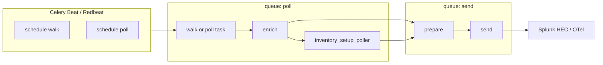
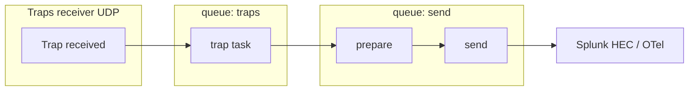

# SC4SNMP – Kubernetes Low‑Level Architecture

This describes the Kubernetes application architecture of **Splunk Connector for SNMP (SC4SNMP)**, structured from the “low level design” diagram into text form. Use this together with **AGENTS.md** (repo layout, dev setup, conventions). The concept is divided into two main operations:

1. **SNMP polling pipeline**
2. **SNMP trap pipeline**

---

## 1. Top-Level Kubernetes Components

### 1.1 Namespace and workload names (from Helm chart)

The Helm chart is **`splunk-connect-for-snmp`** (see `charts/splunk-connect-for-snmp/`). Resource names follow the pattern `{{ .Release.Name }}-<component>` (or the chart fullname helpers). The namespace is the one where the chart is installed (e.g. `sc4snmp` or `default`).

**Deployments** (from `charts/splunk-connect-for-snmp/templates/`):

| Component | Deployment name (pattern) | When created |
|-----------|----------------------------|--------------|
| Scheduler (Celery Beat) | `<release>-splunk-connect-for-snmp-scheduler` | When polling is enabled (`poller.inventory` set) |
| Worker – poller | `<release>-splunk-connect-for-snmp-worker-poller` | When polling is enabled |
| Worker – sender | `<release>-splunk-connect-for-snmp-worker-sender` | Always (sends to Splunk/O11y) |
| Worker – trap | `<release>-splunk-connect-for-snmp-worker-trap` | When traps are enabled |
| Traps (receiver) | `<release>-splunk-connect-for-snmp-trap` | When traps are enabled (LoadBalancer/NodePort/MetalLB configured) |
| Worker – Flower | `<release>-splunk-connect-for-snmp-worker-flower` | When `flower.enabled: true` |
| Splunk Observability Platform (SIM) | `<release>-splunk-connect-for-snmp-sim` | When `sim.enabled: true`; sends metrics to Splunk O11y (Splunk Observability Platform) via OTel Collector |
| UI (frontend, backend, backend-worker; beta) | `ui-frontend-deployment` and UI-specific deployments | When `UI.enable: true` |

**Jobs:**

| Component | Job name (pattern) |
|-----------|---------------------|
| Inventory loader | `<release>-splunk-connect-for-snmp-inventory` |

**StatefulSets / Redis** (from `templates/redis/`):

| Component | Resource name | Notes |
|-----------|----------------|-------|
| Redis standalone | `<release>-redis-standalone` | When `redis.architecture: standalone` |
| Redis HA | `<release>-redis-ha` | When `redis.architecture: replication` |
| Redis Sentinel | `<release>-redis-sentinel` | Used with replication |

**Subcharts** (from `Chart.yaml`; populated in `charts/charts/` only after running `helm dep update` in the chart folder):

| Component | Resource prefix | Notes |
|-----------|-----------------|-------|
| MongoDB | `<release>-mongodb` | Bitnami MongoDB subchart (`charts/charts/mongodb/`) |
| MIB server | `<release>-mibserver` | MIB serving for OID resolution |

**Config and identity:**

- **ConfigMaps:** scheduler-config, scheduler-inventory, traps-config, redis-config, (optional) sim-config, UI configmap-backend.
- **Secrets:** Splunk HEC (`<chart-name>-splunk`), Redis (`<release>-redis-secret`), optional sim secret.
- **ServiceAccount:** From `values.serviceAccount` (default: chart fullname).
- **RBAC:** UI role/role-binding when UI is enabled.
- **PDBs:** Scheduler, traps, worker, sim (when enabled).
- **NetworkPolicies:** Scheduler, traps, worker.

There is no separate “configurator” deployment; the **inventory loader Job** (and scheduler/poller reading config) loads and syncs configuration from Helm values into MongoDB.

### 1.2 Docker Compose installation

SC4SNMP can be run with **Docker Compose** for single-host or small deployments. The Compose file lives in **`docker_compose/docker-compose.yaml`**. The same two pipelines (SNMP polling and SNMP traps) apply; only the topology differs from Kubernetes.

**Network:** All services use the custom network `sc4snmp_network` (configurable subnet via `IPAM_SUBNET` / `IPAM_SUBNET_IPv6`). Optional IPv6 is controlled by `IPv6_ENABLED`.

**Services** (from `docker_compose/docker-compose.yaml`):

| Service name   | Container name    | Role |
|----------------|-------------------|------|
| `coredns`      | `coredns`         | DNS for the stack (required; `COREDNS_ADDRESS` in env). |
| `snmp-mibserver` | `snmp-mibserver` | MIB server for OID resolution (hostname `snmp-mibserver` in env). |
| `redis`        | `redis`           | Celery broker and Redbeat metadata. |
| `mongo`        | `mongo`           | MongoDB for config, inventory, and task state. |
| `inventory`    | `sc4snmp-inventory` | One-off/periodic: loads scheduler config and inventory into MongoDB. |
| `scheduler`    | `sc4snmp-scheduler` | Celery Beat; creates periodic polling tasks. |
| `traps`        | `sc4snmp-traps`   | SNMP trap receiver (UDP, host-published port `TRAPS_PORT` → 2162). |
| `worker-poller` | (replicated)      | Celery worker for polling (default replicas: 2). |
| `worker-sender`| (replicated)      | Celery worker for sending to Splunk/O11y (default: 1). |
| `worker-trap`  | (replicated)      | Celery worker for trap processing (default: 2). |
| `flower`       | (optional)        | Celery Flower UI; under `profiles: [debug]`, port `FLOWER_PORT` → 5555. |

**Configuration:**

- **Environment:** `.env` and env vars (see `docs/dockercompose/6-env-file-configuration.md`). Key anchors in the Compose file: `general_sc4snmp_data` (Redis, Mongo, MIB URLs, `CONFIG_PATH`), `splunk_general_setup` / `splunk_extended_setup` (HEC, sourcetypes, indexes), `workers_general_setup`, `ipv6`, `pysnmp_debug`.
- **Mounted config files (host paths via env):**
  - Scheduler/poller/inventory: `SCHEDULER_CONFIG_FILE_ABSOLUTE_PATH` → `/app/config/config.yaml`
  - Traps: `TRAPS_CONFIG_FILE_ABSOLUTE_PATH` → `/app/config/config.yaml`
  - Inventory CSV: `INVENTORY_FILE_ABSOLUTE_PATH` → `/app/inventory/inventory.csv`
  - SNMP v3 / secrets: `SECRET_FOLDER_PATH` → `/app/secrets/tmp` (when `ENABLE_TRAPS_SECRETS` / `ENABLE_WORKER_POLLER_SECRETS` used)
- **Volumes:** Per-service tmp and pysnmp cache volumes; MIB server has `snmp-mibserver-tmp` and optional `LOCAL_MIBS_PATH` for vendor MIBs.

**Pipeline mapping:**

- **Polling:** `inventory` (load config) → `scheduler` (Celery Beat) → `worker-poller` (SNMP walks) → Redis → `worker-sender` (Splunk HEC). Config and inventory from mounted YAML/CSV and MongoDB.
- **Traps:** Devices send traps to host `TRAPS_PORT` (UDP) → `traps` container → Redis → `worker-trap` and `worker-sender`. Trap config from mounted traps config and MongoDB.

**Docs:** Full Docker Compose setup is described under `docs/dockercompose/` (Splunk requirements, install, inventory, scheduler, traps, `.env`, SNMPv3 secrets, offline install, Splunk logging, IPv6).

---

## 2. Core Infrastructure Services

### 2.1 Redis (Message Broker & Scheduler Metadata)

- **Component:** Redis pod or external Redis service
- **Used for:**
  - Celery message broker (task queues)
  - Optional Redbeat schedule metadata (storing periodic task definitions)
- **Queues (Celery):**
  - `poll` – polling tasks (walk, poll, enrich, inventory_setup_poller); consumed by worker-poller
  - `send` – prepare/send tasks; consumed by worker-sender
  - `traps` – trap processing task; consumed by worker-trap
  - Redbeat uses Redis for periodic schedule storage
- **Data type:** ephemeral; messages, schedules, task status

### 2.2 MongoDB (Persistent Storage)

- **Component:** MongoDB pod or external MongoDB (default database: `sc4snmp`, from `MONGO_DB`)
- **Used for:**
  - Storing SC4SNMP configuration (parsed from Helm values / config)
  - Device inventory and SNMP target definitions
  - Polling task definitions and Redbeat schedule metadata (in Redis; legacy schedules were in MongoDB)
  - Trap configuration (trap hosts, mappings)
  - Enrichment state (targets, attributes) for polling and prepare/send

- **Collections** (see `splunk_connect_for_snmp` usage):
  - **`inventory`** – Device inventory (address, port, group, etc.); source for walk/poll targets.
  - **`targets`** – Per-address state: sysUpTime, `state` for tracked fields (sysDescr, sysObjectID, sysContact, sysName, sysLocation); used by enrich and inventory_setup_poller.
  - **`attributes`** – Per-address and group_key_hash; persisted fields for enrichment; read/updated by enrich, cleared per target by inventory processor.
  - **`profiles`** – Polling profiles (OIDs, frequency, etc.); loaded by ProfilesManager, written by inventory_setup_poller.
  - **`groups`** – Group definitions; loaded by GroupsManager from config or UI.
  - **`inventory_ui`**, **`groups_ui`**, **`profiles_ui`**, **`used_ui`** – UI-sourced config when using the SC4SNMP UI (beta); loader and collection manager read/update these.
  - **`schema_version`** – Schema migration version (single doc); used by migration scripts.
  - **`engine_id_records`** – SNMPv3 engine ID cache per device; used for trap/auth.

Periodic schedule data is stored in **Redis** (Redbeat); legacy `schedules` collection was migrated to Redbeat and dropped.

---

## 3. External Integrations

### 3.1 SNMP Devices (Agents)

- Network devices (routers, switches, firewalls, UPS, etc.)
- Support:
  - SNMP v1/v2c/v3 polling on UDP/161
  - SNMP traps to UDP/162

### 3.2 Observability Destinations

- **Splunk HEC**
  - Endpoint: `https://<splunk-hec-host>:8088/services/collector`
  - Data:
    - Events (logs)
    - Metrics
- **Splunk Observability Platform**
- **OTel Collector**
  - Receives metrics/events via OTLP/HTTP or other protocols
  - Forwards to downstream backends

---

## 4. Main Operations Overview

The architecture is organized into two main operational flows:

1. **SNMP Polling Pipeline** – periodic pulls of metrics/state from devices.
2. **SNMP Trap Pipeline** – asynchronous trap reception and forwarding.

### 4.1 Celery queues and workers

Celery uses three named queues (see `splunk_connect_for_snmp/celery_config.py`). Workers consume from specific queues:

| Queue   | Exchange | Consumed by        | Tasks |
|---------|----------|--------------------|-------|
| `poll`  | poll     | worker-poller      | `snmp.tasks.walk`, `snmp.tasks.poll`, `enrich.tasks.enrich`, `inventory.tasks.inventory_setup_poller` |
| `send`  | send     | worker-sender      | `splunk.tasks.prepare`, `splunk.tasks.send` |
| `traps` | traps    | worker-trap        | `snmp.tasks.trap` |

Redbeat (Celery Beat) writes periodic schedule entries to Redis; the scheduler pod runs Beat and enqueues the initial task of each chain to the `poll` queue.

### 4.2 Polling task chains

Two types of periodic polling are scheduled:

**Walk** (periodic walk for a device/profile; e.g. after discovery or device restart). Scope depends on configuration: by default only `SNMPv2-MIB` is walked; if a walk profile is defined, only its OID scope is walked; if `ENABLE_FULL_WALK` is set to `true`, a full OID tree walk is performed:

- **Trigger:** Redbeat schedule or explicit “run walk” (e.g. after `enrich` detects sysUpTime decrease).
- **Chain:**  
  `snmp.tasks.walk` → `enrich.tasks.enrich` → **group of** `inventory.tasks.inventory_setup_poller` → `splunk.tasks.prepare` → `splunk.tasks.send`  
- **Queues:** `walk`, `enrich`, and `inventory_setup_poller` on `poll`; `prepare` and `send` on `send`.
- **Roles:**  
  - `walk`: SNMP walk, returns `{ address, result, … }`.  
  - `enrich`: Processes `result["result"]` **by group** (each key is a group_key, e.g. index group; uses `group_key_hash` for MongoDB). **Writes/updates MongoDB:** (1) **targets** (per address): `sysUpTime`, and `state` for tracked fields (sysDescr, sysObjectID, sysContact, sysName, sysLocation); (2) **attributes** (per address + group_key_hash): upserts docs with `id`, `indexes`, and `fields`, and applies bulk/update for new or modified fields. **Reads from attributes** and merges persisted fields back into the in-memory result so downstream (prepare/send) receives enriched metrics/events. Detects device restart (sysUpTime decrease) and triggers a new walk (scoped by walk profile or `ENABLE_FULL_WALK`) when needed. Returns the (possibly enriched) result.  
  - `inventory_setup_poller`: Assigns profiles, may create/update periodic poll tasks in Redbeat, then chains prepare→send per “work” item.  
  - `prepare`: Builds HEC payload (events/metrics).  
  - `send`: POSTs to Splunk HEC (and optionally OTel).

**Poll** (recurring poll for a device):

- **Trigger:** Redbeat schedule (periodic).
- **Chain:**  
  `snmp.tasks.poll` → `enrich.tasks.enrich` → `splunk.tasks.prepare` → `splunk.tasks.send`  
- **Queues:** `poll` and `enrich` on `poll`; `prepare` and `send` on `send`.
- **Roles:** Same as above; no `inventory_setup_poller` (no profile (re)assignment in the chain).

(Walk chain includes `inventory_setup_poller`; poll chain goes straight from `enrich` to `prepare`.)

### 4.3 Trap task chain

When the traps receiver gets an SNMP trap (UDP), it builds a `work` payload and enqueues a single chain:

- **Chain:**  
  `snmp.tasks.trap` → `splunk.tasks.prepare` → `splunk.tasks.send`  
- **Queues:** `trap` on `traps`; `prepare` and `send` on `send`.
- **Roles:**  
  - `trap`: Decodes varbinds, resolves MIBs, builds normalized result (sourcetype traps), returns work for prepare.  
  - `prepare` / `send`: Same as polling; format and POST to HEC (and optionally OTel).

---

## 5. Operation 1 – SNMP Polling Pipeline

### 5.1 Components

1. **SC4SNMP Poller**
   - Kubernetes: `<release>-splunk-connect-for-snmp-worker-poller` (Deployment)
   - Docker Compose: `worker-poller` service
   - Python app using Celery workers.
   - Responsibilities:
     - Load configuration and inventory from MongoDB / config files.
     - Execute SNMP GET/GETBULK against devices.
     - Transform raw SNMP responses into internal metric/event representations.
     - Enqueue sending tasks to Redis for the Sender worker.

2. **Celery Beat / Scheduler**
   - Kubernetes: `<release>-splunk-connect-for-snmp-scheduler` (Deployment)
   - Docker Compose: `scheduler` service
   - Runs Celery Beat.
   - Reads polling schedules (intervals) from MongoDB or static config.
   - Creates Celery tasks on Redis at desired intervals.

3. **SC4SNMP Sender**
   - Kubernetes: `<release>-splunk-connect-for-snmp-worker-sender` (Deployment)
   - Docker Compose: `worker-sender` service
   - Celery worker consuming tasks from the `send` queue.
   - Responsibilities:
     - Take normalized metrics/events from polling pipeline.
     - Batch and serialize them to:
       - Splunk HEC
       - Splunk Observability Platform
       - OTel Collector
     - Handle retries, backoff, and error logging.

4. **Redis**
   - Stores Celery tasks for Poller → Sender pipeline.

5. **MongoDB**
   - Stores:
     - Device inventory and SNMP configs
     - Polling task definitions
     - Destination definitions
     - Possibly state / metadata about last polling runs

---

### 5.2 Detailed Flow (Polling)

**1. Configuration Phase**

Both deployments read configuration from the same sources: a `config.yaml` (profiles, groups) and an `inventory.csv` (device list). In Kubernetes these are provided via ConfigMaps templated from `values.yaml`; in Docker Compose they are mounted directly via `SCHEDULER_CONFIG_FILE_ABSOLUTE_PATH` and `INVENTORY_FILE_ABSOLUTE_PATH`.

On startup the inventory loader (`<release>-splunk-connect-for-snmp-inventory` Job in Kubernetes, `inventory` service in Docker Compose) reads these files, writes profiles, groups, and inventory records into MongoDB, and schedules periodic walk tasks in Redbeat for each new or modified inventory record. `inventory_setup_poller` runs later as part of the walk chain (after a walk completes) to assign poll profiles and schedule recurring poll tasks.

**2. Scheduling Phase**

- Celery Beat (scheduler pod) uses Redbeat: schedule entries live in **Redis**, not MongoDB.
- Periodic tasks are created by the inventory loader and `inventory_setup_poller` (from MongoDB `inventory` and `profiles`); Redbeat stores and triggers them at the configured intervals.

**3. Execution Phase (Poller Worker)**

- Poller Celery worker reads tasks from the `poll` queue in Redis.
- For each device/task:
  1. Build SNMP request (GET/GETBULK) with relevant varbinds.
  2. Perform SNMP query to device (UDP/161; SNMP v1/v2c/v3).
  3. Process response:
     - Map OIDs → MIB symbols.
     - Build metric(s) and/or contextual event(s):
       - Device identifiers (IP, hostname, system descriptions, etc.)
       - Interface identifiers (ifIndex, ifName, etc.)
       - Measurement values (counters, gauges)
       - Timestamps.
  4. The task chain then runs enrich → prepare → send; the Sender consumes from the `send` queue.

**4. Sending Phase (Sender Worker)**

- Sender Celery worker consumes from the `send` queue.
- For each batch:
  - Convert to destination format:
    - **Splunk HEC**:
      - Events: JSON with `event`, `host`, `source`, `sourcetype`, `index`
      - Metrics: HEC metrics format
    - **Splunk Observability Platform**:
      - Data points with dimensions
    - **OTel Collector**:
      - OTLP metrics/logs
  - Send via HTTP/HTTPS.
  - On failure:
    - Retry with backoff (Celery).
    - Log error information.

---

### 5.3 Polling Summary

- **Kubernetes (chart names):**
  - `<release>-splunk-connect-for-snmp-scheduler` (Celery Beat)
  - `<release>-splunk-connect-for-snmp-worker-poller`
  - `<release>-splunk-connect-for-snmp-worker-sender`
  - `<release>-redis` (service; standalone StatefulSet: `<release>-redis-standalone`)
  - `<release>-mongodb` (subchart)
- **Docker Compose services:** `scheduler`, `worker-poller`, `worker-sender`, `redis`, `mongo`
- **Queues:**
  - `poll` (polling tasks: walk, poll, enrich, inventory_setup_poller)
  - `send` (sending tasks: prepare, send)
- **External:**
  - SNMP devices on UDP/161
  - Splunk HEC / Splunk Observability Platform / OTel Collector

---

## 6. Operation 2 – SNMP Trap Pipeline

### 6.1 Components

1. **SC4SNMP Traps Receiver**
   - Kubernetes: `<release>-splunk-connect-for-snmp-trap` (Deployment); listens on UDP/2162 inside the pod, exposed as port 162 via a `Service` (LoadBalancer / NodePort / ClusterIP + Ingress).
   - Docker Compose: `traps` service; listens on UDP/2162, host port published as `TRAPS_PORT`.
   - Responsibilities:
     - Receive SNMP traps from network devices.
     - Parse trap PDU:
       - `trap_oid`
       - `sysUptime`
       - Variable bindings.
     - Enrich trap data with device context (from MongoDB).
     - Apply trap mappings (severity, event templates).
     - Forward normalized events/metrics to Sender via Redis.

2. **SC4SNMP Sender (shared with polling pipeline)**
   - Kubernetes: `<release>-splunk-connect-for-snmp-worker-sender`; Docker Compose: `worker-sender` service.
   - Same Sender worker as for polling.
   - Handles converted trap events/metrics and sends them to Splunk/Splunk Observability Platform.

3. **Redis**
   - Holds Celery tasks for trap processing and sending.
   - Queues: `traps` (trap task, consumed by worker-trap), `send` (prepare/send, consumed by worker-sender).

4. **Configuration and MongoDB**
   - Trap receiver config (communities, v3 users, etc.) is primarily loaded from the traps **config YAML** (`CONFIG_PATH`); some data (e.g. engine IDs) is also read from and written to MongoDB.
   - MongoDB is used by the traps process for the `engine_id_records` collection: discovered SNMPv3 engine IDs are persisted there (keyed by device IP) and loaded back on startup so they survive restarts.

---

### 6.2 Detailed Flow (Traps)

**1. Trap Configuration**

- Network devices are configured to send traps to the cluster (e.g. Service IP/host on port 162).
- Trap receiver config (communities, SNMPv3 usernameSecrets, etc.) comes from the **traps config YAML** (Helm values → traps-config ConfigMap, or Docker Compose `TRAPS_CONFIG_FILE_ABSOLUTE_PATH`). The traps process reads `CONFIG_PATH` and does not use MongoDB for trap source/mapping collections.

**2. Trap Reception**

- SC4SNMP Traps container listens on UDP/2162 (Kubernetes: exposed as 162 by the Service; Docker Compose: published as `TRAPS_PORT` on the host).
- When a trap arrives:
  1. **Raw datagram interception (SNMPv3 engine ID discovery):** Before pysnmp parses the message, a custom UDP transport (`_EngineIDCaptureUdpTransport`) intercepts the raw datagram. If `DISCOVER_ENGINE_ID=true`, it decodes the ASN.1 security parameters to extract the sender's engine ID and username. If the engine ID is new and the username matches a configured V3 user, it is immediately registered with pysnmp via `config.addV3User` with that `securityEngineId` — so pysnmp can authenticate the trap in the same receive loop. This handles devices that send traps with their own engine ID without prior registration.
  2. Parse SNMP message:
     - Determine source IP, community, version.
     - Extract trap OID and varBinds.
  3. Decode and normalize (MIB resolution, v3 engine ID from config/cache).
  4. Build normalized trap event:
     - Device info (host, IP, vendor, etc.).
     - Trap details (OID, variables).
     - Optionally include `context_engine_id` field if `INCLUDE_SECURITY_CONTEXT_ID=true`.
  5. **Persist engine ID:** The decoded engine ID is saved to MongoDB (`engine_id_records` collection) keyed by device IP. On startup, engine IDs are synced bidirectionally between `SNMP_V3_SECURITY_ENGINE_ID` env var and MongoDB so previously discovered IDs survive restarts.
  6. Enqueue chain: trap task (queue `traps`) → prepare → send (queue `send`).

**3. Trap Sending**

- Sender Celery worker handles trap events similar to polling events:
  - Serialize for destination.
  - Send via HTTP/HTTPS.
  - Retry on failure.

---

### 6.3 Traps Summary

- **Kubernetes (chart names):**
  - `<release>-splunk-connect-for-snmp-trap` (traps receiver)
  - `<release>-splunk-connect-for-snmp-worker-sender` (shared)
  - `<release>-splunk-connect-for-snmp-worker-trap` (trap worker, when enabled)
  - `<release>-redis`
  - `<release>-mongodb`
- **Docker Compose services:** `traps`, `worker-trap`, `worker-sender`, `redis`, `mongo`
- **Queues:**
  - `traps` (trap task; worker-trap)
  - `send` (prepare, send; worker-sender, shared with polling)
- **External:**
  - SNMP devices sending traps on UDP/162
  - Splunk HEC

---

## 7. Cross‑Cutting Concerns

### 7.1 Security & Secrets

- **Kubernetes:** Secrets for SNMP v3 credentials, Redis passwords, and HEC tokens / API tokens. RBAC: ServiceAccounts for SC4SNMP pods with minimal required permissions.
- **Docker Compose:** Credentials provided via `.env` file and env vars; SNMPv3 secrets optionally managed via `manage_secrets.py` and the `SECRET_FOLDER_PATH` mount.

### 7.2 Configuration Management

- **Kubernetes:** Helm chart `values.yaml` is the main configuration source (SNMP targets, trap sources, polling intervals, destination URLs, Redis/Mongo endpoints). On upgrade, Helm redeploys pods and configuration is reloaded and re-synced into MongoDB.
- **Docker Compose:** Configuration comes from the `.env` file, mounted `config.yaml` (`SCHEDULER_CONFIG_FILE_ABSOLUTE_PATH` / `TRAPS_CONFIG_FILE_ABSOLUTE_PATH`), and `inventory.csv` (`INVENTORY_FILE_ABSOLUTE_PATH`). Re-run `docker compose up -d` to apply changes.

### 7.3 Monitoring & Logging

- Each container/pod logs to stdout/stderr:
  - Poller execution logs
  - Trap receiver logs
  - Sender delivery logs
- **Kubernetes:** Optional health endpoints (`/healthz`, `/metrics`) for readiness/liveness probes.
- **Docker Compose:** Optional Celery Flower UI available under `--profile debug` (`docker compose --profile debug up`) at `FLOWER_PORT`.