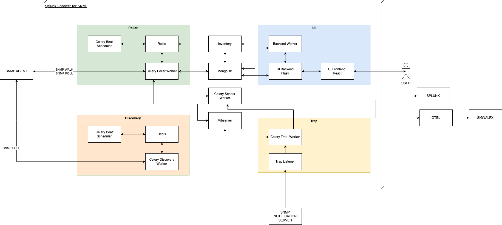

# Architecture

SC4SNMP is deployed using a Kubernetes distribution, typically MicroK8s,
that's designed to be a low-touch experience for integration with sensitive
edge network devices. It will typically be deployed in the same network
management zone as the monitored devices and separated from Splunk by an
existing firewall.

## High-level Design 

SC4SNMP has two main purposes. The first one is used to collect SNMP data from network 
devices according to planned schedules and the second one is responsible for listening to SNMP traps.

Diagram above present high level architecture of Splunk Connector for SNMP, it contains following components:

- **UI** - user interface for configuring the SC4SNMP profiles, groups, and inventory.
- **Poller** - responsible for getting selected data from SNMP agents in set periods of time.
- **Trap** - responsible for listening and receiving trap notifications from SNMP agents.
- **MIB Server** - responsible for serving MIBs to SNMP Workers and translating oid to varbinds.
- **MongoDB** - used for storing configuration and state of the SC4SNMP.
- **Inventory** - job used for updating the information about SC4SNMP configuration.
- **Sender** - responsible for sending data received from poller or trap workers to the Splunk HEC or OTel.

