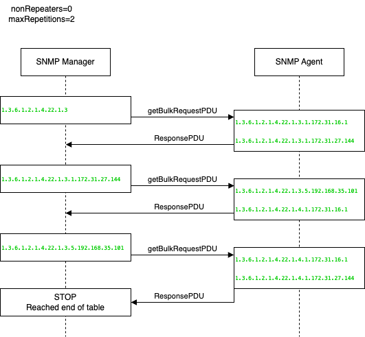

# Poller Configuration

Poller is a service which is responsible for querying
SNMP devices using the SNMP GET and WALK functionalities. Poller executes two main types of tasks:

- The Walk task executes SNMP walk. SNMP walk is an SNMP application that uses SNMP GETNEXT requests to
collect SNMP data from the network and infrastructure of SNMP-enabled devices, such as switches and routers. It is a time-consuming task,
which may overload the SNMP device when executed too often. It is used by the SC4SNMP to collect and push all OID values, which the provided ACL has access to.

- The Get task is a lightweight task that queries a subset of OIDs defined by the customer. This task monitors OIDs, such as memory or CPU utilization.

Poller has an `inventory`, which defines what and how often SC4SNMP has to poll.

### Poller configuration file

/// tab | microk8s
The poller configuration is kept in a `values.yaml` file in the `poller` section.
`values.yaml` is used during the installation process for configuring Kubernetes values.

See the following poller example configuration:
```yaml
poller:
  usernameSecrets:
   - sc4snmp-hlab-sha-aes
   - sc4snmp-hlab-sha-des
  enableFullWalk: false
  inventory: |
    address,port,version,community,secret,security_engine,walk_interval,profiles,smart_profiles,max_oid_to_process,delete
    10.202.4.202,,2c,public,,,2000,,,,
```

!!! info
    The header line (`address,port,version,community,secret,security_engine,walk_interval,profiles,smart_profiles,max_oid_to_process,delete`) is necessary for the correct execution of SC4SNMP. Do not remove it.

!!! info
    Starting with version 1.15.0, the max_oid_to_process field has been introduced as an optional addition to the inventory header. This update is backward compatible, and existing inventory headers remain fully supported.

///

/// tab | docker compose
The poller behaviour is configured via environment variables in `.env`. The inventory is configured in a separate `inventory.csv` file - see [Inventory configuration](inventory.md).
///

### Disable automatic polling of base profiles

There are [two profiles](https://github.com/splunk/splunk-connect-for-snmp/blob/main/splunk_connect_for_snmp/profiles/base.yaml) that are being polled by default, so that even without any configuration set up, you can see
the data in Splunk. You can disable it with the following parameter:

/// tab | microk8s
```yaml
poller:
  pollBaseProfiles: false
```
///

/// tab | docker compose
Set in `.env`:
```
POLL_BASE_PROFILES=false
```
///

### Default walk scope

The default walk profile is polling only `SNMPv2-MIB`. If the full OID tree walk is required it can be enabled:

/// tab | microk8s
```yaml
poller:
  enableFullWalk: true
```
///

/// tab | docker compose
Set in `.env`:
```
ENABLE_FULL_WALK=true
```
///

### IPv6 hostname resolution

When IPv6 is enabled and device is dual stack, the hostname resolution will try to resolve the name to the IPv6 address first, then to the IPv4 address.

### Define maxRepetitions

The maxRepetitions is a parameter used in SNMP GetBulk call. It is responsible for controlling the
amount of variables in one request.

/// tab | microk8s
```yaml
poller:
  maxRepetitions: 10
```
///

/// tab | docker compose
Set in `.env`:
```
MAX_REPETITIONS=10
```
///

`maxRepetitions` variable is the amount of requested next oids in response for each of varbinds in one request sent.

For example:

The configured variables:

/// tab | microk8s
```yaml
poller:
  maxRepetitions: 2
```
///

/// tab | docker compose
```
MAX_REPETITIONS=2
```
///

The requested varbinds in one getBulk call:
```
IP-MIB.ipNetToMediaNetAddress
```

[](../images/request_pdu_flow.png)

After third ResponsePDU the returned oids are out of scope for requested table, so the call is stopped.
It can be spotted on diagram that response for `IP-MIB.ipNetToMediaNetAddress` includes 2 oids as max repetition variable was set to 2.

### Define usernameSecrets

Secrets are required to run SNMPv3 polling. To add v3 authentication details, create the secret: [SNMPv3 Configuration](snmpv3.md), and put its name in `usernameSecrets`.

/// tab | microk8s
```yaml
poller:
  usernameSecrets:
    - sc4snmp-hlab-sha-aes
```
///

/// tab | docker compose
In docker compose, SNMPv3 credentials are managed through `secrets.json`. Set the path to the folder containing it in `.env`:

```
SECRET_FOLDER_PATH=/absolute/path/to/secrets/folder
```

All secrets defined in `secrets.json` are automatically available to the poller. See [SNMPv3 configuration](snmpv3.md) for details on creating secrets.
///

### Append OID index part to the metrics

Not every SNMP metric object is structured with its index as a one of the field values. We can append the index part of OID with:

/// tab | microk8s
```yaml
poller:
  metricsIndexingEnabled: true
```
///

/// tab | docker compose
Set in `.env`:
```
METRICS_INDEXING_ENABLED=true
```
///

So the following change will make this metric object (derived from the OID `1.3.6.1.2.1.6.20.1.4.0.0.443`)

```
{
   frequency: 5
   metric_name:sc4snmp.TCP-MIB.tcpListenerProcess: 309
   mibIndex: 0.0.443
   profiles: generic_switch
}
```

out of this object:
```
{
   frequency: 5
   metric_name:sc4snmp.TCP-MIB.tcpListenerProcess: 309
   profiles: generic_switch
}
```

### Replace "-" with "_" in metrics name

There is a known issue with metric names that are not following the Splunk metric schema. Read more at [addressing metric naming](../troubleshooting/general-issues.md#addressing-metric-naming-conflicts-for-splunk-integration).
To ensure seamless compatibility and avoid potential issues, SC4SNMP provides a configuration option to automatically convert
hyphens in metric names to underscores.

/// tab | microk8s
You can enable this conversion by setting the `splunkMetricNameHyphenToUnderscore` parameter to `true` within the `poller` section of your SC4SNMP configuration:

```yaml
poller:
  splunkMetricNameHyphenToUnderscore: true
```
///

/// tab | docker compose
Set in `.env`:
```
SPLUNK_METRIC_NAME_HYPHEN_TO_UNDERSCORE=true
```
///

Enabling this option transforms metric names from their hyphenated format to an underscore-separated format, aligning them with common Splunk metric naming conventions.

Before conversion (hyphens):

```json
{
  "frequency": "60",
  "ifAdminStatus": "up",
  "ifAlias": "1",
  "ifDescr": "GigabitEthernet1",
  "ifIndex": "1",
  "ifName": "Gi1",
  "ifOperStatus": "up",
  "ifPhysAddress": "0a:aa:ef:53:67:15",
  "ifType": "ethernetCsmacd",
  "metric_name:sc4snmp.IF-MIB.ifInDiscards": 0,
  "metric_name:sc4snmp.IF-MIB.ifInErrors": 0,
  "metric_name:sc4snmp.IF-MIB.ifInOctets": 1481605109,
  "metric_name:sc4snmp.IF-MIB.ifOutDiscards": 0,
  "metric_name:sc4snmp.IF-MIB.ifOutErrors": 0,
  "metric_name:sc4snmp.IF-MIB.ifOutOctets": 3942570709,
  "profiles": "TEST"
}
```

After conversion (underscores):

```json
{
  "frequency": "60",
  "ifAdminStatus": "up",
  "ifAlias": "1",
  "ifDescr": "GigabitEthernet1",
  "ifIndex": "1",
  "ifName": "Gi1",
  "ifOperStatus": "up",
  "ifPhysAddress": "0a:aa:ef:53:67:15",
  "ifType": "ethernetCsmacd",
  "metric_name:sc4snmp.IF_MIB.ifInDiscards": 0,
  "metric_name:sc4snmp.IF_MIB.ifInErrors": 0,
  "metric_name:sc4snmp.IF_MIB.ifInOctets": 1481605109,
  "metric_name:sc4snmp.IF_MIB.ifOutDiscards": 0,
  "metric_name:sc4snmp.IF_MIB.ifOutErrors": 0,
  "metric_name:sc4snmp.IF_MIB.ifOutOctets": 3942570709,
  "profiles": "TEST"
}
```

### Configure inventory

See [Inventory configuration](inventory.md) for the full field reference and instructions on how to apply changes.