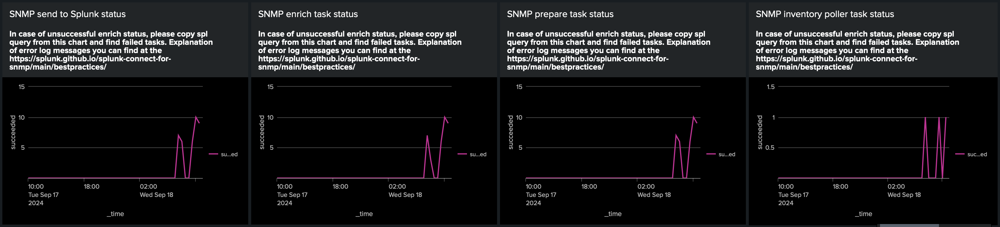

# Dashboard

Using dashboard you can monitor SC4SNMP and be sure that is healthy and working correctly.

## Presetup Splunk and SC4SNMP

1. [Create metrics indexes](gettingstarted/splunk-requirements.md#requirements-for-splunk-enterprise-or-enterprise-cloud) in Splunk.
2. Enable metrics logging for your runtime:
    * For K8S install [Splunk OpenTelemetry Collector for K8S](gettingstarted/sck-installation.md)
    * For docker-compose use [Splunk logging driver for docker](dockercompose/9-splunk-logging.md)

## Install dashboard

1. In Splunk platform open **Search -> Dashboards**.
2. Click on **Create New Dashboard** and make an empty dashboard. Be sure to choose Classic Dashboards.
3. In the **Edit Dashboard** view, go to Source and replace the initial xml with the contents of [dashboard/dashboard.xml](https://github.com/splunk/splunk-connect-for-snmp/blob/main/dashboard/dashboard.xml) published in the SC4S repository.
4. Saving your changes. Your dashboard is ready to use.

## Metrics explanation

### Polling dashboards

For check that polling for your SNMP device working correctly first of all you need to look at **SNMP schedule of polling tasks** dahsboard.
Using this chart you can understand when SC4SNMP scheduled polling for your SNMP device last time. If it regulary running is okay, otherwise you will see permanently zero scheduled tasks.

After that we doublechecked that SC4SNMP scheduled polling tasks for your SNMP device we need to be sure that polling working correctly.
For that look at another dashboard **SNMP polling status** and if everything is okay you will see only **succeeded** status of polling.
If something going wrong you will see also another statuses (like on screenshot), then use [troubleshooting docs for that](bestpractices.md)

*Note: if you set very big polling period like 2 hours, it's okay that you haven't found during this 2 hours new polling tasks*

### Walk dashboards

For check that walk for your SNMP device working correctly first of all you need to look at **SNMP schedule of walk tasks** dahsboard.
Using this chart you can understand when SC4SNMP scheduled walk for your SNMP device last time. If it regulary running is okay, otherwise you will see permanently zero scheduled tasks.

After that we doublechecked that SC4SNMP scheduled walk tasks for your SNMP device we need to be sure that walk working correctly.
For that look at another dashboard **SNMP walk status** and if everything is okay you will see only **succeeded** status of polling.
If something going wrong you will see also another statuses (like on screenshot), then use [troubleshooting docs for that](bestpractices.md)

*Note: if you set very big walk period like 2 hours, it's okay that you haven't found during this 2 hours new walk tasks*

### Trap dashboards

First of all you need to look at **SNMP traps auth** dashboard, if you will see only **succeeded** status it means auth configured correctly, otherwise please use [troubleshooting docs for that](bestpractices.md#identifying-traps-issues).

After that we checked that we haven't any auth traps issues we can check that trap tasks working correctly. For that we need to go **SNMP trap status**
dashboard, if we have only **succeeded** status it means that everything, otherwise we will se info with another statuses.

### Other dashboards

We also have tasks that will be a callbcak for walk & poll. For example **send** will publish result in Splunk. We need to be sure that after successfull walk & poll this callbacks finished successfully. Please check that we have only succefull statuses for this tasks

