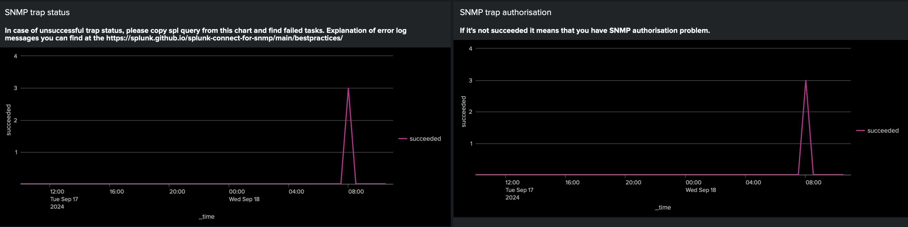

# Dashboard

Using dashboard you can monitor SC4SNMP and be sure that is healthy and working correctly.

## Presetting

1. [Create metrics indexes](gettingstarted/splunk-requirements.md#requirements-for-splunk-enterprise-or-enterprise-cloud) in Splunk.
2. Enable metrics logging for your runtime:
    * For K8S install [Splunk OpenTelemetry Collector for K8S](gettingstarted/sck-installation.md)
    * For docker-compose use [Splunk logging driver for docker](dockercompose/9-splunk-logging.md)

## Install dashboard

1. In Splunk platform open **Search -> Dashboards**.
2. Click on **Create New Dashboard** and make an empty dashboard. Be sure to choose Classic Dashboards.
3. In the **Edit Dashboard** view, go to Source and replace the initial xml with the contents of [dashboard/dashboard.xml](https://github.com/splunk/splunk-connect-for-snmp/blob/main/dashboard/dashboard.xml) published in the SC4SNMP repository.
4. Save your changes. Your dashboard is ready to use.

## Metrics explanation

### Polling dashboards

To check that polling on your device is working correctly first of all check **SNMP schedule of polling tasks** dashboard.
Using this chart you can understand when SC4SNMP scheduled polling for your SNMP device last time. The process works if it runs regularly.

After double-checking that SC4SNMP scheduled polling tasks for your SNMP device we need to be sure that polling is working.
For that look at another dashboard **SNMP polling status** and if everything is working you will see only **succeeded** status of polling.
If something is going wrong you will see also another status (like on screenshot), then use [troubleshooting docs for that](bestpractices.md)

### Walk dashboards

To check that walk on your device is working correctly first of all check **SNMP schedule of walk tasks** dashboard.
Using this chart you can understand when SC4SNMP scheduled walk for your SNMP device last time. The process works if it runs regularly.

After double-checking that SC4SNMP scheduled walk tasks for your SNMP device we need to be sure walk is working.
For that look at another dashboard **SNMP walk status** and if everything is working you will see only **succeeded** status of walk.
If something is going wrong you will see also another status (like on screenshot), then use [troubleshooting docs for that](bestpractices.md)

### Trap dashboards

First of all check **SNMP traps authorisation** dashboard, if you see only **succeeded** status it means that authorisation is configured correctly, otherwise please use [troubleshooting docs for that](bestpractices.md#identifying-traps-issues).

After checking that we have not any authorisation traps issues we can check that trap tasks are working correctly. For that we need to go **SNMP trap status** dashboard, if we have only **succeeded** status it means that everything is working, otherwise we will see information with another status.

### Other dashboards

We also have tasks that will be a callback for walk and poll. For example **send** will publish result in Splunk. We need to be sure that after successful walk and poll this callbacks finished. Please check that we have only  successful status for this tasks.

