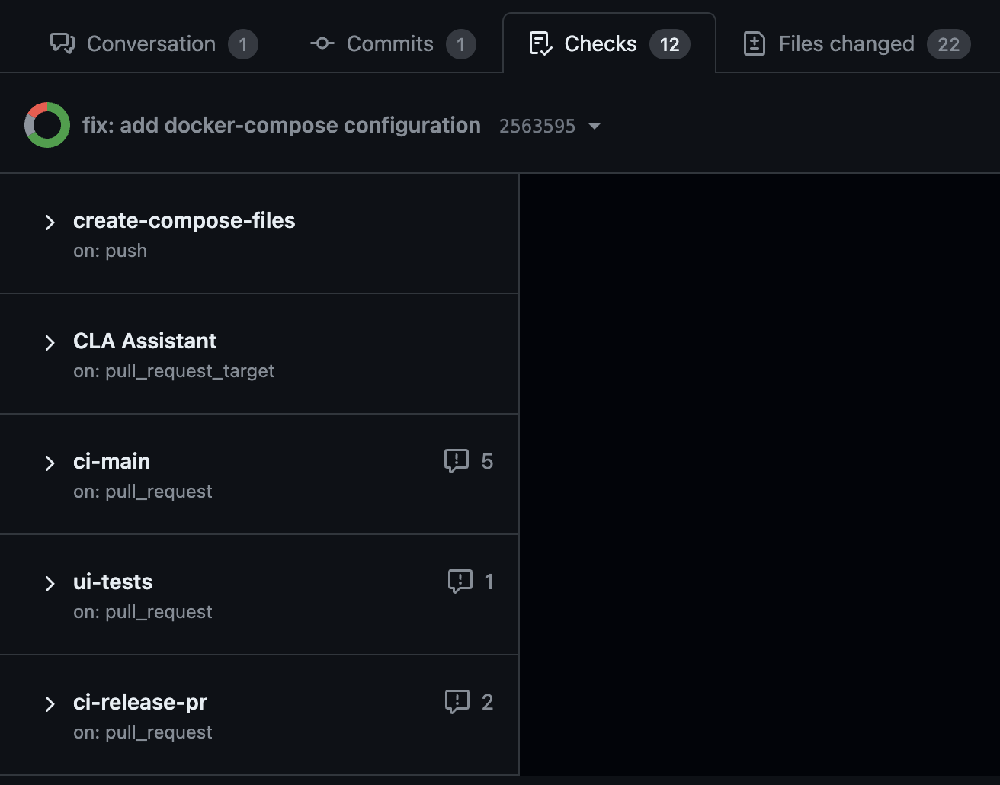
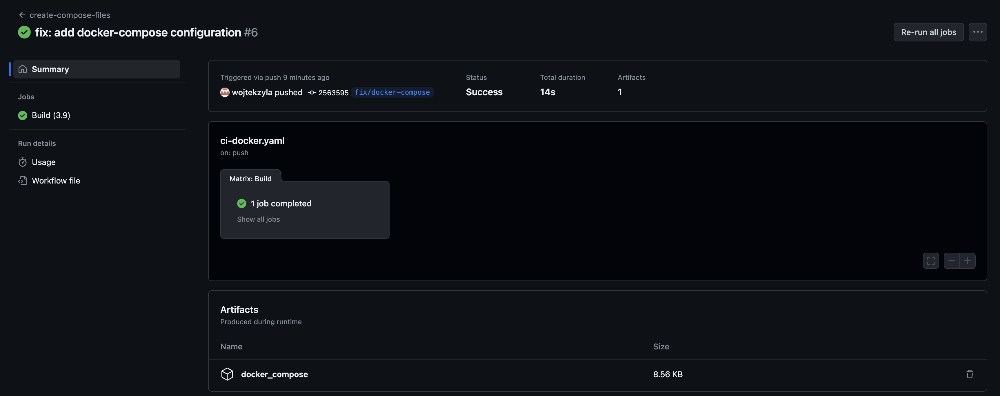

# Download package with docker compose files

## Downloading a package
Currently, docker compose installation is not released. Package with the necessary files can be downloaded form
the GitHub branch [fix/docker-compose](https://github.com/splunk/splunk-connect-for-snmp/pull/937/checks). After entering 
this link, click the `create-compose-files` workflow which can be seen on the left side:

{style="border:2px solid; width:500px; height:auto" }

<hr style="border:2px solid">

Then click `Summary` button on the left side. At the bottom of the page in the `Artifacts` section there will be 
`docker_compose` package. Download it and unzip it in your environment.

{style="border:2px solid; width:800px; height:auto" }

<hr style="border:2px solid">

## Deploy the app
After following the rest of the instructions with the configuration details, application can be deployed by running the
following command inside the `docker_compose` directory:

```shell
sudo docker compose $(find docker* | sed -e 's/^/-f /') up -d
```

Every time any update is made to the configuration, the same command can be run to apply these changes.

## Uninstall the app

To uninstall the app, run the following command inside the `docker_compose` directory:

```shell
sudo docker compose $(find docker* | sed -e 's/^/-f /') down
```