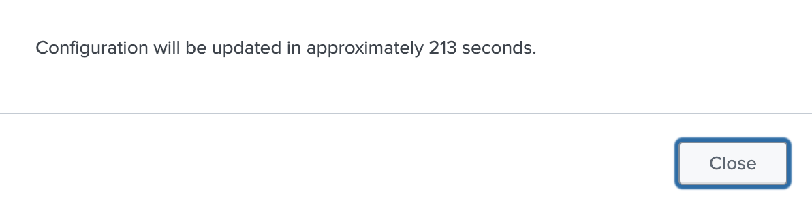
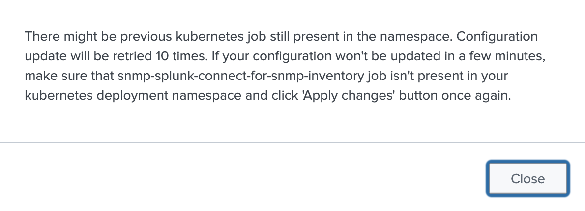

# Apply changes

In order to apply changes from the GUI to the core SC4SNMP, press the `Apply changes` button. Update can be made minimum 5 minutes
after the previous one was applied. If the `Apply changes` button is clicked earlier, new update will be scheduled automatically 
and the following message with ETA will be displayed:

{ style="border:2px solid; width:500px; height:auto" }

Scheduled update triggers new kubernetes job `job/snmp-splunk-connect-for-snmp-inventory`. If the ETA elapsed and the 
previous `job/snmp-splunk-connect-for-snmp-inventory` is still present in the `sc4snmp` kubernetes namespace,
creation of the new job will be retried 10 times. If `Apply changes` is clicked during retries, the following message
will be displayed:

{ style="border:2px solid; width:500px; height:auto" }