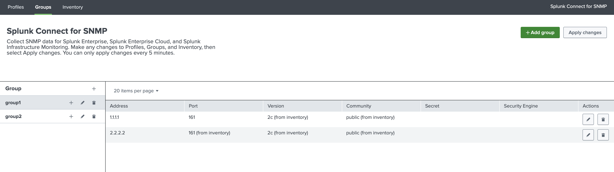
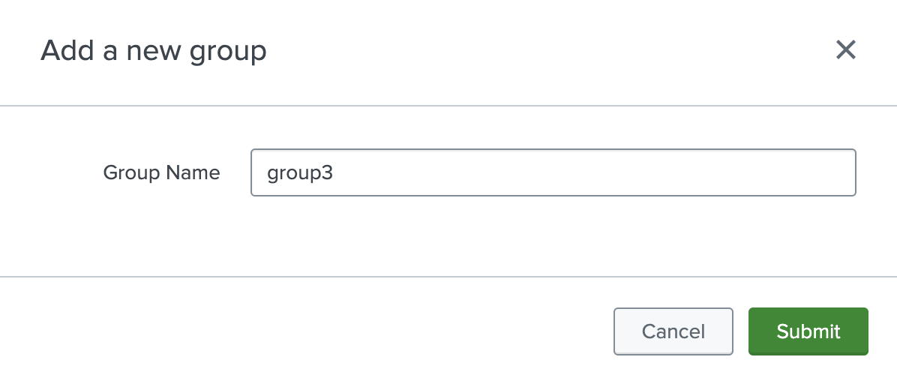
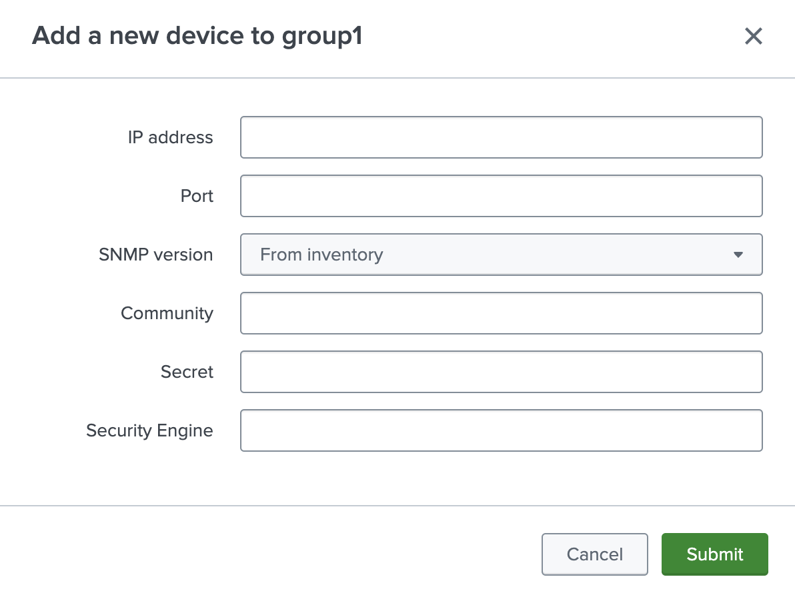
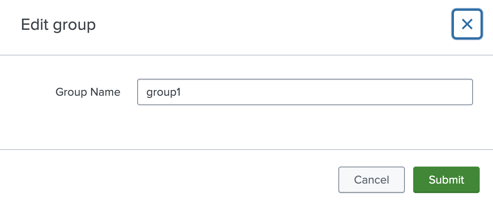
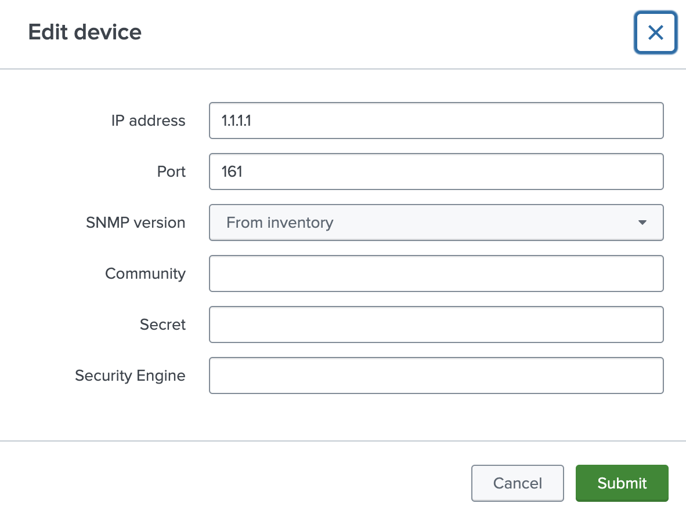

# Configuring groups in GUI

SC4SNMP [groups](../configuration/configuring-groups.md) can be configured in `Groups` tab.

{ style="border:2px solid" }

After pressing `Add group` button or plus sign next to the `Group`, new group can be added.

{style="border:2px solid; width:500px; height:auto" }

Configured groups are displayed on the left-hand side, under the `Group name` label. After clicking on the group name, 
all devices belonging to the given group are displayed. To add a new device, click the plus sign next to the group name. 
Configuration of the device is the same as in the `values.yaml` file [(check here)](../configuration/configuring-groups.md).

{style="border:2px solid; width:500px; height:auto" }

To edit a group name, click the pencil icon next to the group name.

{style="border:2px solid; width:500px; height:auto" }

To edit device, click the pencil icon in the row of the given device.

{style="border:2px solid; width:500px; height:auto" }