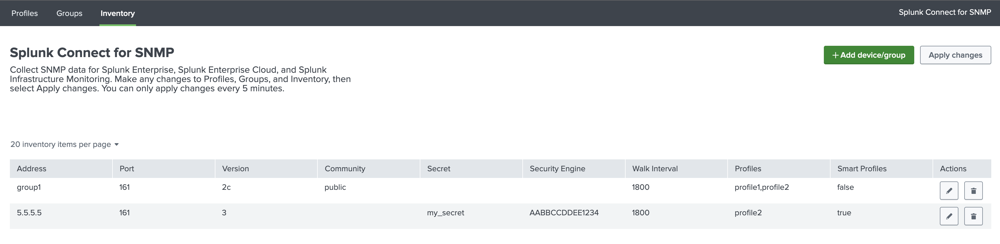
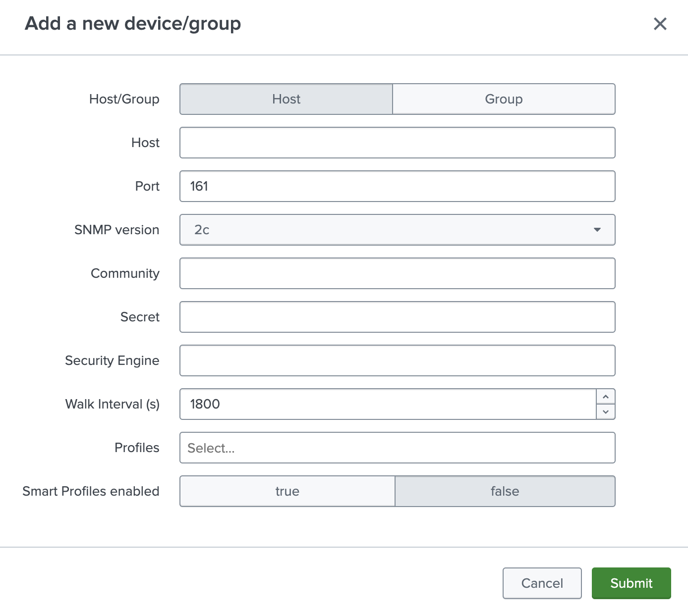
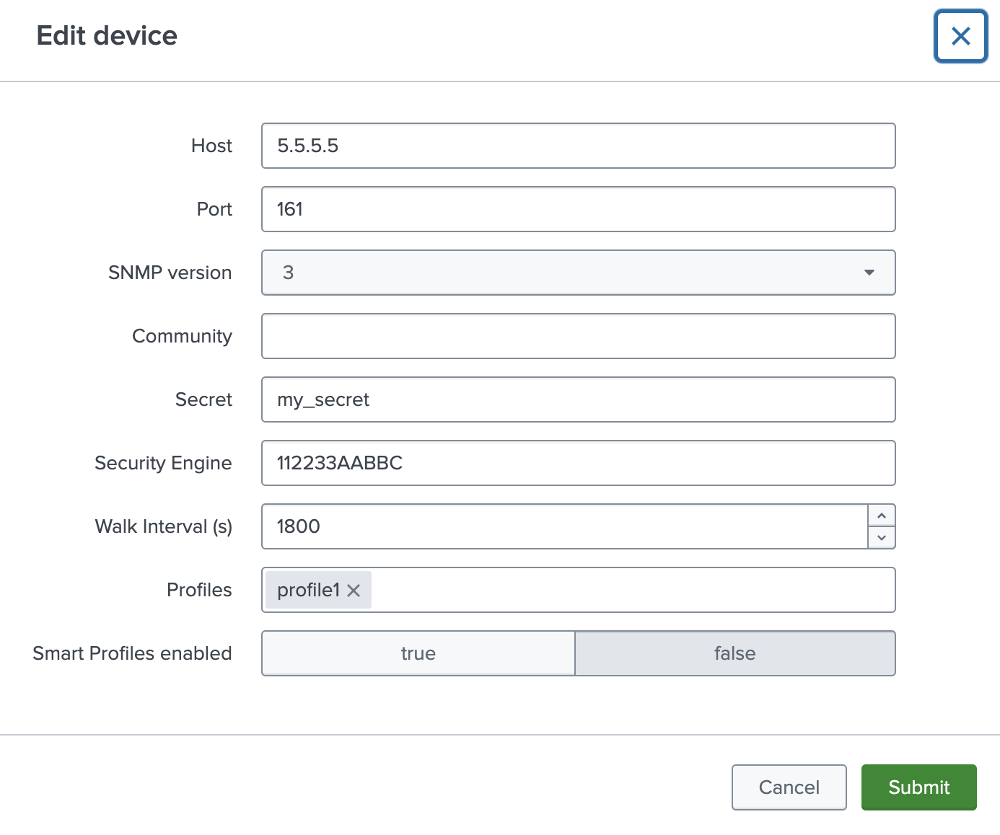
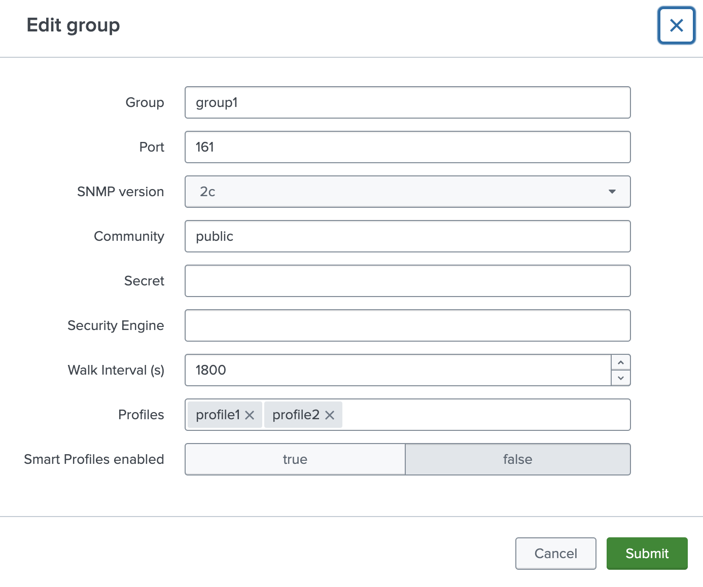

# Configuring inventory in GUI

SC4SNMP [inventory](../configuration/poller-configuration.md#poller-configuration-file) can be configured in `Inventory` tab.

{ style="border:2px solid" }

After pressing `Add device/group` button, new single device or group can be added.
Configuration of the device is the same as in the `inventory.yaml` file [(check here)](../configuration/poller-configuration.md#poller-configuration-file).

{style="border:2px solid; width:500px; height:auto" }

To edit a device or group, click the pencil icon next in the desired row.

{style="border:2px solid; width:500px; height:auto" }
{style="border:2px solid; width:500px; height:auto" }