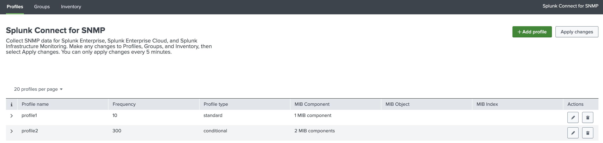
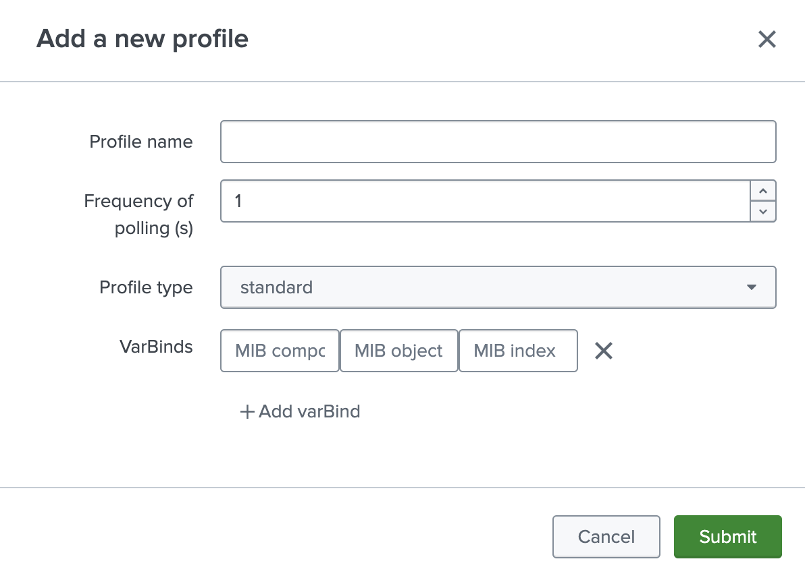
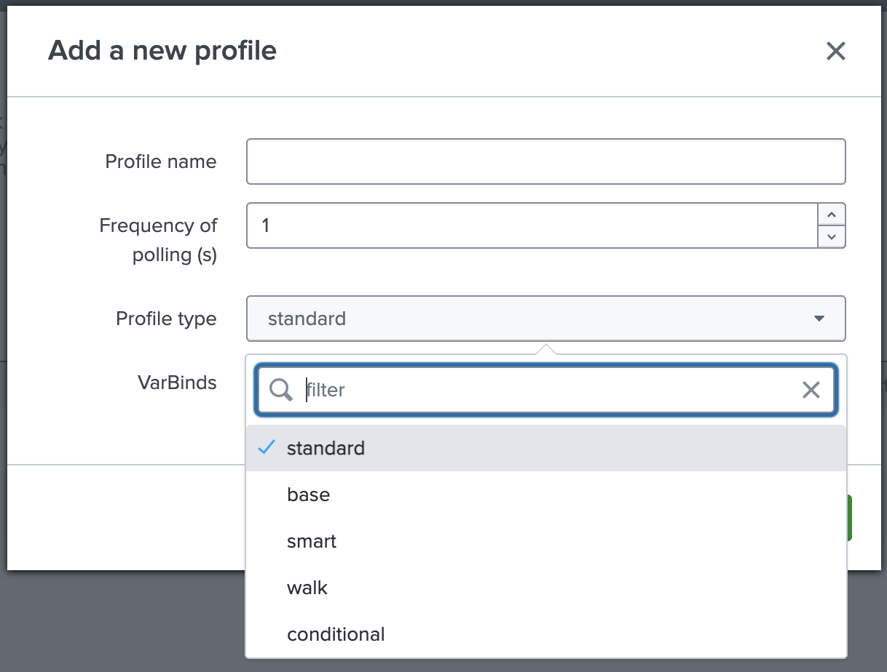
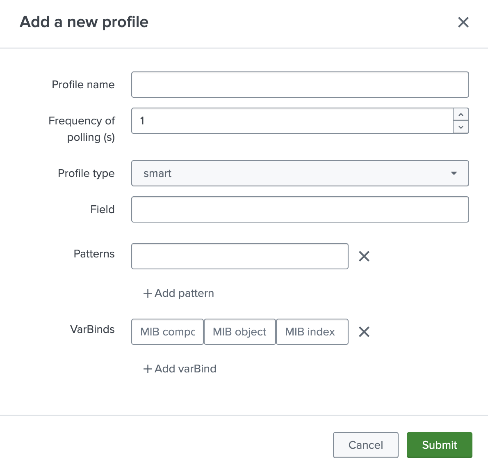
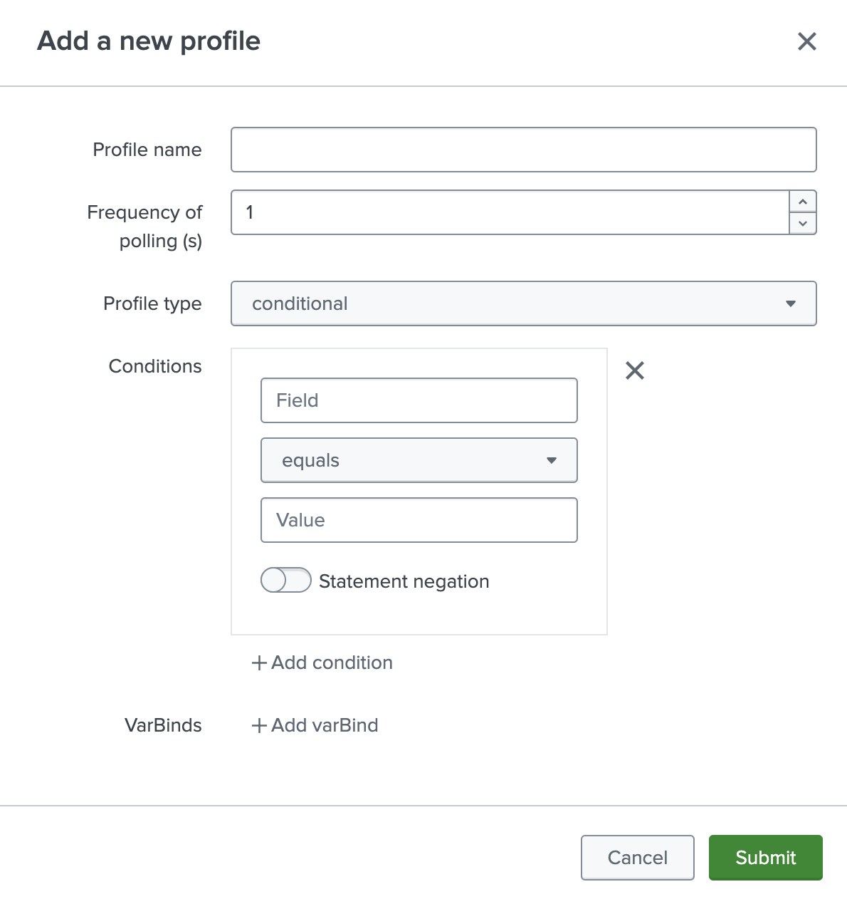
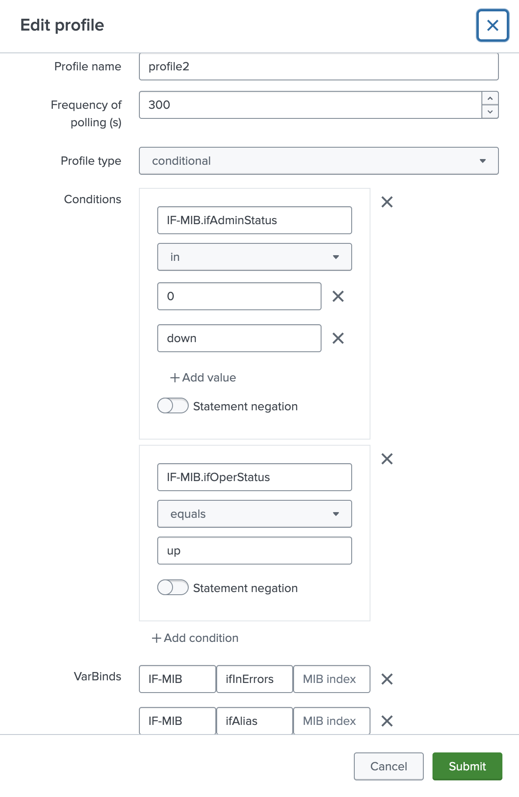

# Configuring profiles in GUI

SC4SNMP [profiles](../configuration/configuring-profiles.md) can be configured in `Profiles` tab.

{ style="border:2px solid" }

After pressing `Add profile` button, new profile will be added.
Configuration of the profile is the same as in the `values.yaml` file [(check here)](../configuration/configuring-profiles.md).

{style="border:2px solid; width:500px; height:auto" }

Type of the profile can be changed:

{ style="border:2px solid; width:500px; height:auto" }

Examples of configuration of `Smart` and `Conditional` profiles:

{ style="border:2px solid; width:500px; height:auto" }
{ style="border:2px solid; width:500px; height:auto" }

All configured profiles can be edited by clicking the pencil icon:

{ style="border:2px solid; width:500px; height:auto" }