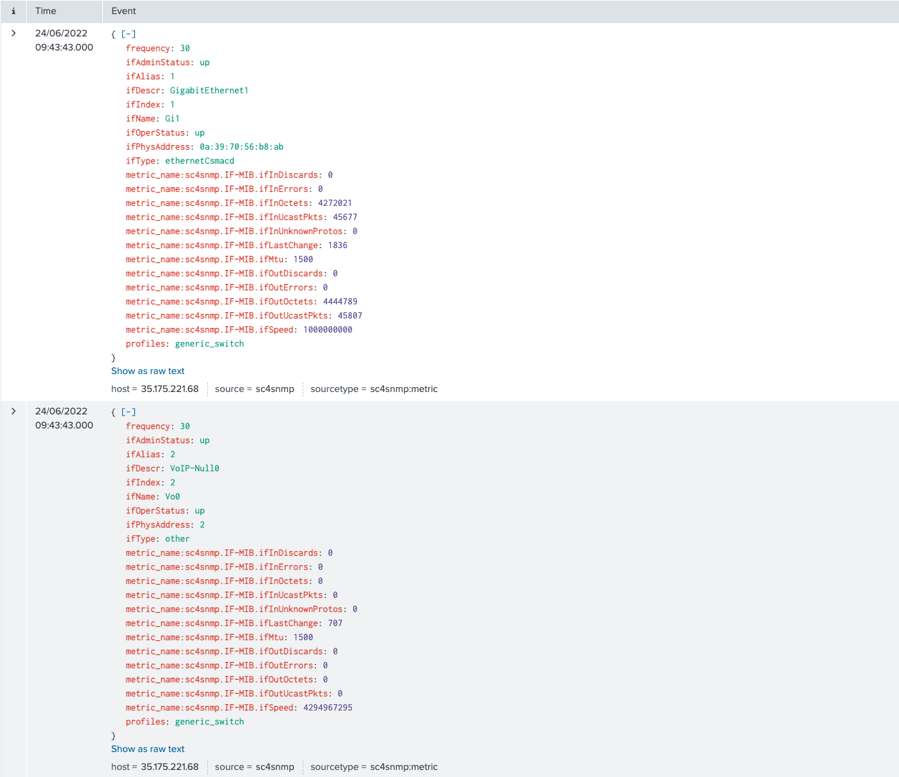
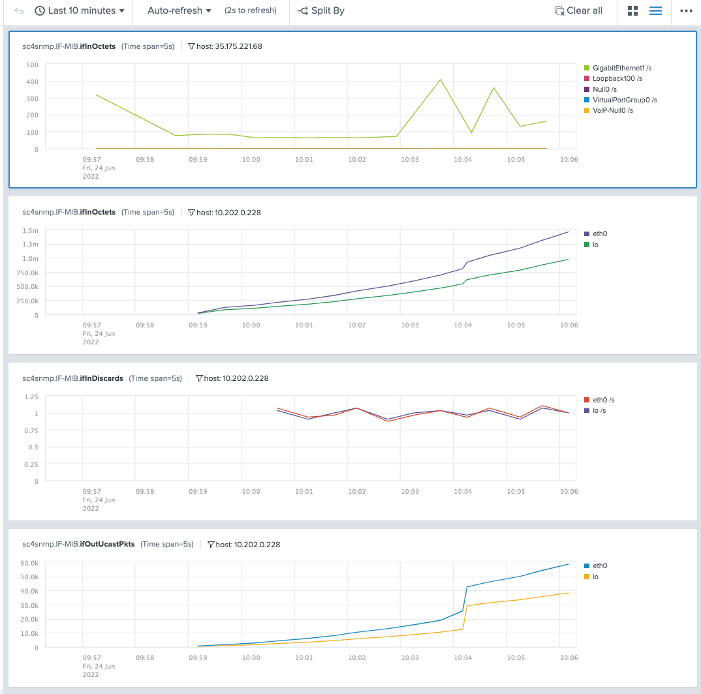
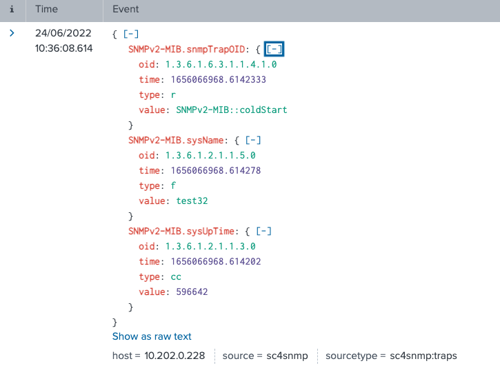

# Splunk Connect for SNMP

Splunk welcomes your experimentation and feedback. Let your
account team know that you are testing Splunk Connect for SNMP.

Splunk Connect for SNMP is an edge-deployed, containerized, and highly
available solution for collecting SNMP data for Splunk Enterprise,
Splunk Enterprise Cloud, and Splunk Infrastructure Monitoring.

SC4SNMP provides context-full information. It not only forwards SNMP data to Splunk, but also integrates the data into 
meaningful objects. For example, you do not need to write queries in order to gather information about
interfaces of the device, because SC4SNMP does that automatically:

This makes it easy to visualize the data in Splunk Analytics:

Here is a short presentation of how to browse SNMP data in Splunk:

<video controls width="100%">
  <source src="videos/setting_analytics.mp4" type="video/mp4">
  Your browser does not support the video tag.
</video>

SC4SNMP can also easily monitor trap events sent by different SNMP devices. Trap events are JSON formatted, and are stored under the `netops` index.

