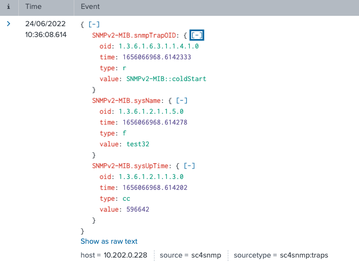

# Splunk Connect for SNMP

Splunk welcomes your experimentation and feedback. Let your
account team knows you are testing Splunk Connect for SNMP.

Splunk Connect for SNMP is an edge-deployed, containerized, and highly
available solution for collecting SNMP data for Splunk Enterprise,
Splunk Enterprise Cloud and Splunk Infrastructure Monitoring.

SC4SNMP provides context-full information - not only forwards SNMP data to Splunk, but also combines 
all of pieces into the meaningful objects. For example, you don't need to write queries in order to gather the information about
interfaces of the device, because SC4SNMP does that automatically:

What makes it easy to visualize the data in Analytics of Splunk:

Here is a short presentation of how to browse SNMP data in Splunk:

SC4SNMP can also easily monitor trap events sent by different SNMP devices. Trap events are JSON formatted, and are being stored under `netops` index.

