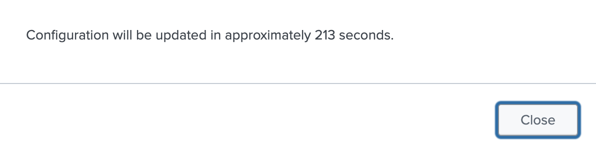
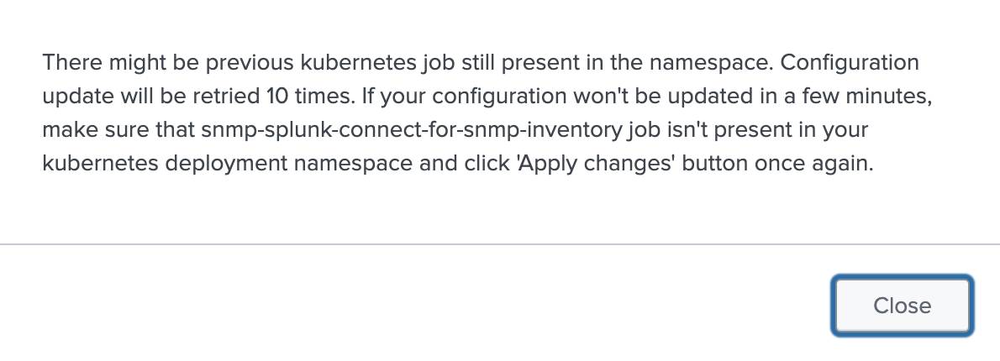
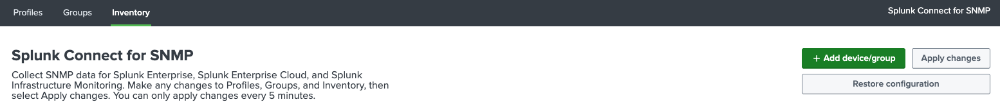
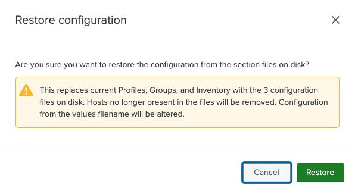

# Apply changes

In order to apply changes from the GUI to the core SC4SNMP, press the `Apply changes` button. Update can be made minimum 5 minutes
after the previous one was applied. If the `Apply changes` button is clicked earlier, new update will be scheduled automatically 
and the following message with ETA will be displayed:

{ style="border:2px solid; width:500px; height:auto" }

Scheduled update triggers new kubernetes job `job/snmp-splunk-connect-for-snmp-inventory`. If the ETA elapsed and the 
previous `job/snmp-splunk-connect-for-snmp-inventory` is still present in the `sc4snmp` kubernetes namespace,
creation of the new job will be retried 10 times. If `Apply changes` is clicked during retries, the following message
will be displayed:

{ style="border:2px solid; width:500px; height:auto" }

## Restore configuration

{ style="border:2px solid" }

Pressing `Restore configuration`, next to `Apply changes`, reloads Profiles, Groups, and Inventory from the configuration files provided at deployment time, replacing whatever has since been configured through the GUI. Hosts no longer present in those files are removed from the inventory. 

{ style="border:2px solid; width:500px; height:auto" }

This action cannot be undone, so it must be confirmed in a warning dialog before it runs. Once confirmed, the restore triggers the same update job described above, so the same 5-minute cooldown and retry behavior applies.