# Configuring groups in GUI

SC4SNMP [groups](../../configuration/groups.md) can be configured in `Groups` tab.

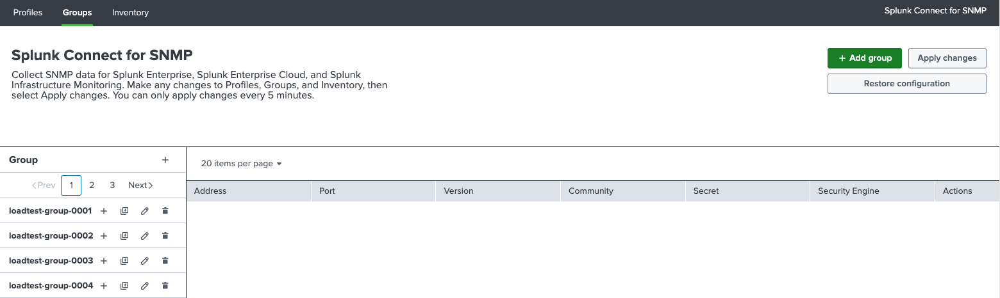{ style="border:2px solid" }

## Add group

After pressing `Add group` button or plus sign next to the `Group`, new group can be added.

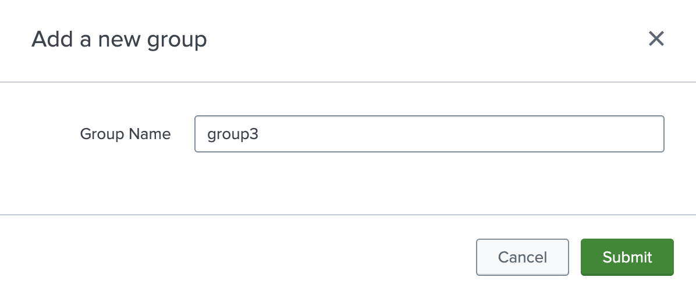{style="border:2px solid; width:500px; height:auto" }

Configured groups are displayed on the left-hand side, under the `Group name` label. After clicking on the group name, 
all devices belonging to the given group are displayed. 

## Add device

To add a new device, click the plus sign next to the group name. 
Configuration of the device is the same as in the `values.yaml` file. For details check [Configuring groups](../../configuration/groups.md).

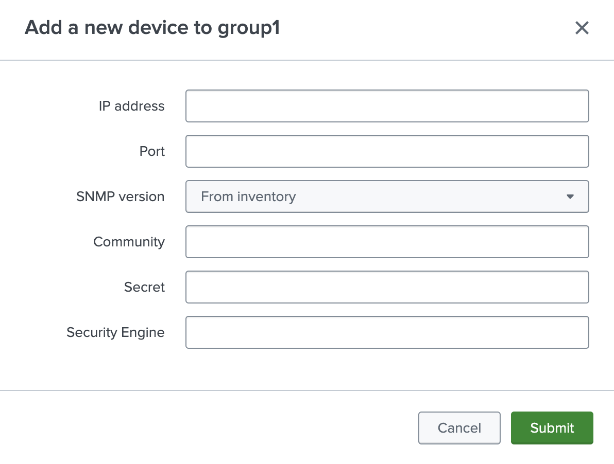{style="border:2px solid; width:500px; height:auto" }

## Add multiple devices at the same time

To add several devices to a group at once, click the bulk-add icon next to the plus sign, in the row of the given group, to open the `Add devices in bulk` window.

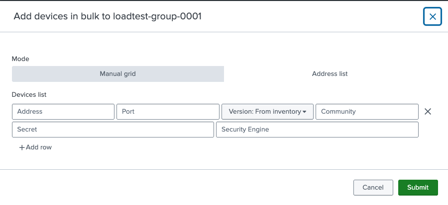{style="border:2px solid; width:500px; height:auto" }

By default, the window opens in `Manual grid` mode, where every row of the grid is a separate device with the same fields as adding a single device: `Address`, `Port`, `Version`, `Community`, `Secret` and `Security Engine`. Click `Add row` to add more devices to the grid.

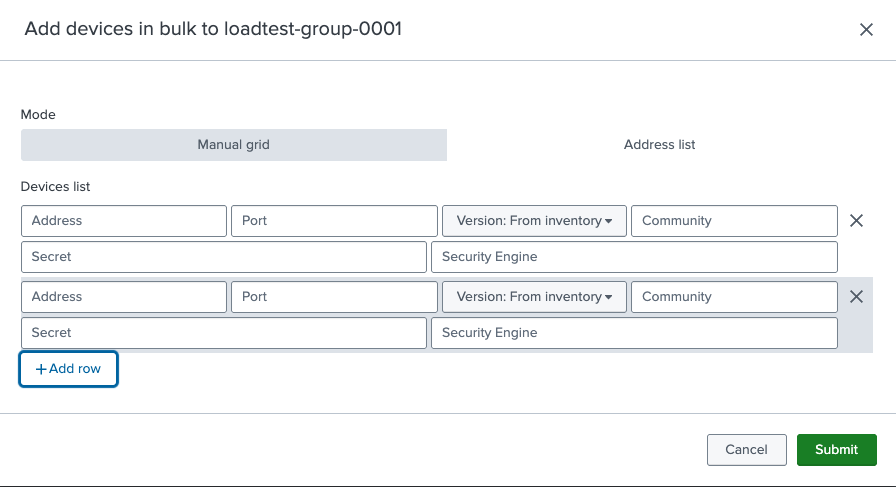{style="border:2px solid; width:500px; height:auto" }

Switching the mode to `Address list` allows pasting a list of addresses instead of filling the grid row by row.

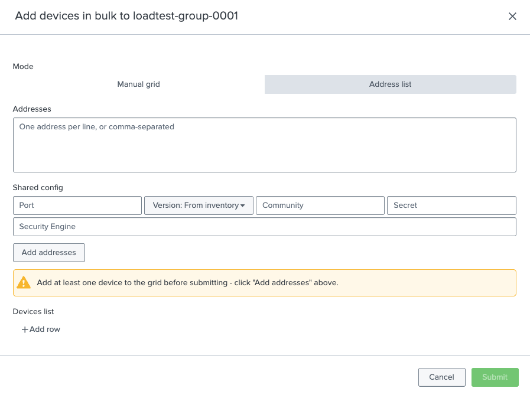{style="border:2px solid; width:500px; height:auto" }

Enter the addresses, one per line or comma-separated, in the `Addresses` field, and optionally fill in the `Shared config` (`Port`, `Version`, `Community`, `Secret`, `Security Engine`) to apply to all of them.

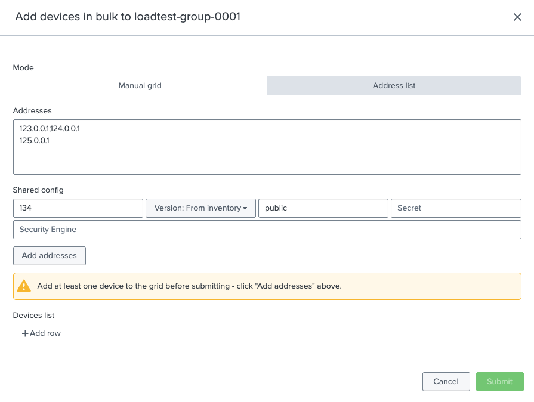{style="border:2px solid; width:500px; height:auto" }

Click `Add addresses` to parse the addresses into the `Devices list` grid below. Blank lines, lines starting with `#`, and duplicate addresses are skipped, and every remaining address is pre-filled with the shared config. Rows can still be edited or removed from the grid before submitting.

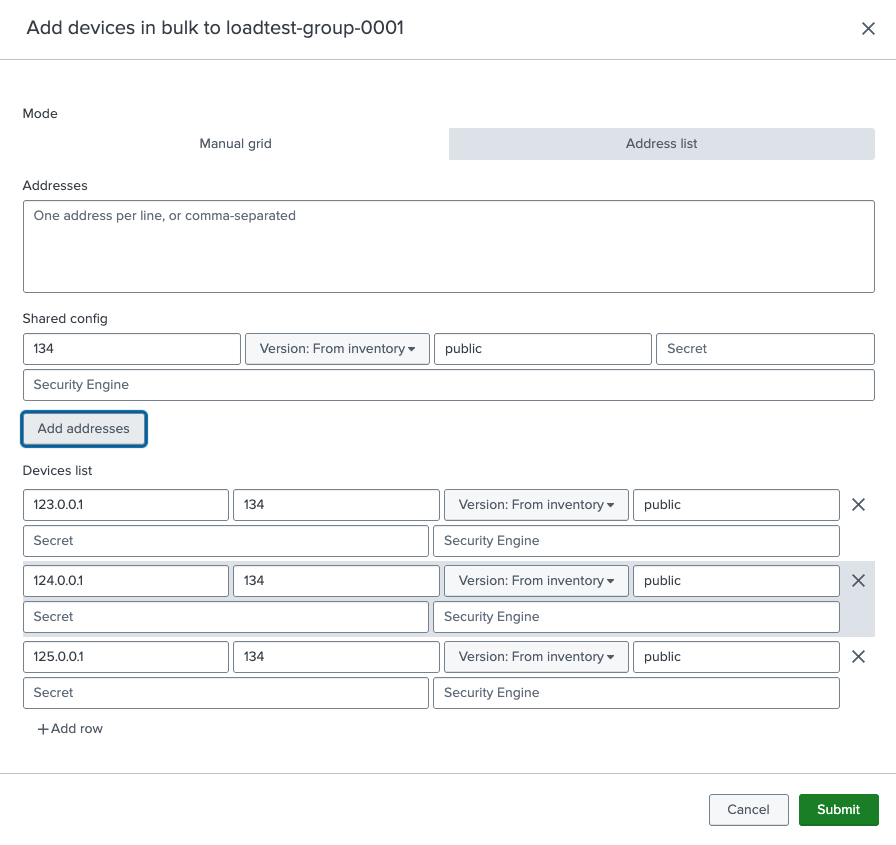{style="border:2px solid; width:500px; height:auto" }

Click `Submit` to add the devices to the group. A row that fails validation is flagged with an inline error message and is not saved, so it can be corrected before submitting again. Successfully added devices appear on the group's device list.

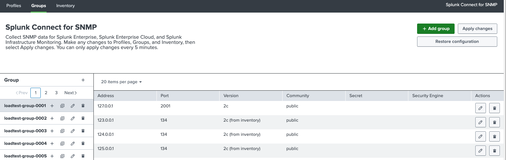{ style="border:2px solid" }

## Edit group

To edit a group name, click the pencil icon next to the group name.

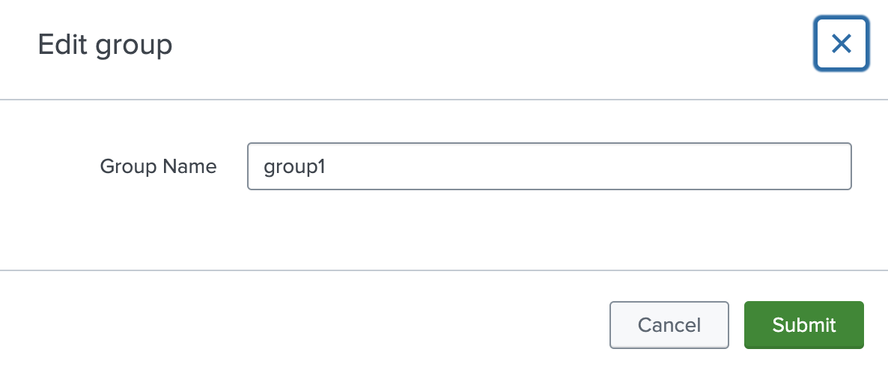{style="border:2px solid; width:500px; height:auto" }

## Edit device

To edit device, click the pencil icon in the row of the given device.

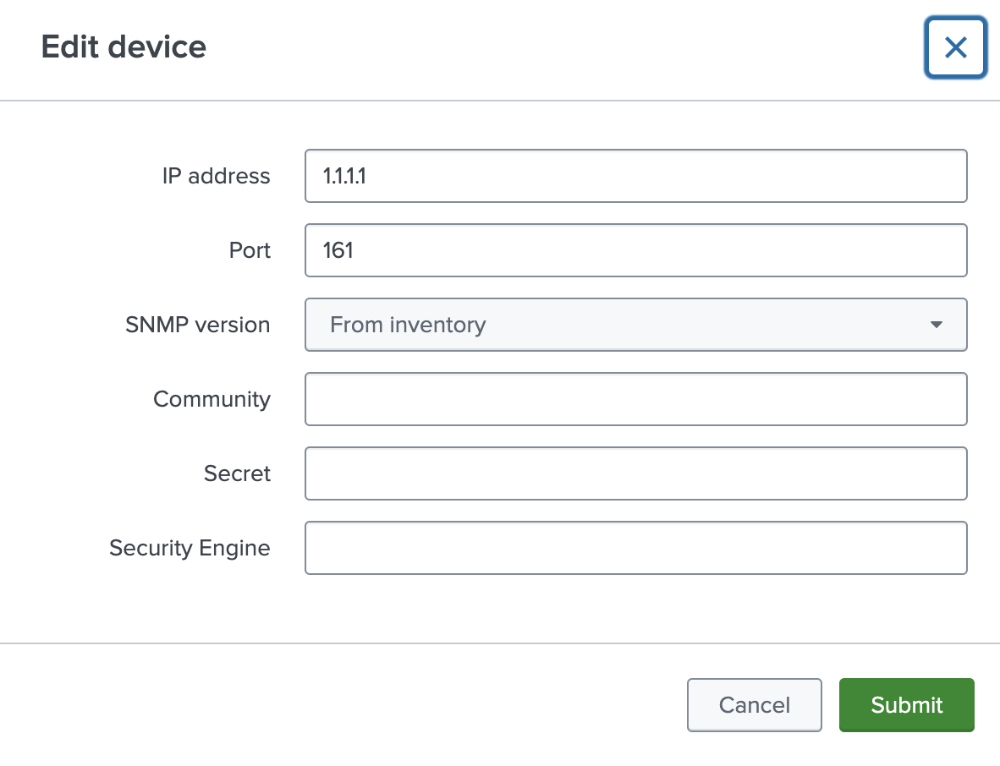{style="border:2px solid; width:500px; height:auto" }