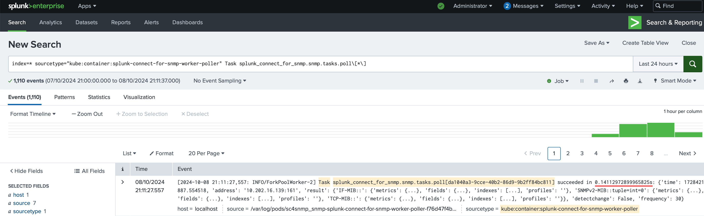

# Scaling SNMP with microk8s

The following guide is to present how to bootstrap master and replica nodes for microk8s cluster and to explore the possibilities of scaling SC4SNMP.

## Scaling criteria

Below is the formula that can help with deciding when to scale the system.

`2 * periodic_task_exec_time * inventory_size >= workers_count * task_period`

where:

* `inventory_size` - Amount of item in inventory (`values.yaml`).
* `workers_count` - Amount of running workers for `polling` / `walk` (pod workers).
* `task_period` - `walk` / `polling` period time (`values.yaml`).
* `periodic_task_exec_time` - Execution time of `polling` / `walk` task (metrics at screenshot).



If the left side of equation is higher you need to scale `workers_count` or increase `task_period`.


## Make microk8s cluster

### Bootstrap master node

1. Setup master node using following [guide](./k8s-microk8s.md). 

2. Generate joining token for replicas:

```bash
microk8s add-node
```

3. After running `add-node` on stdout you will get a command (like `microk8s join <master_node>:25000/<token>`) that you need to remember.

### Bootstrap replica nodes

1. Installing microk8s on replica node: 

```bash
sudo snap install microk8s --classic --channel=1.30/stable
sudo usermod -a -G microk8s $USER
sudo chown -f -R $USER ~/.kube
su - $USER
```

2. After running `add-node` on **master node** you will get on stdout command that you need to run on your **replica node**:

```bash
microk8s join <master_node>:25000/<token>
```

3. Check that replica joined cluster:

```bash
microk8s kubectl get nodes
```

New nodes should appear:

```bash
NAME                  STATUS   ROLES    AGE   VERSION
i-05ecfbf799e480188   Ready    <none>   25h   v1.30.5
i-0733cb329576e6c78   Ready    <none>   25h   v1.30.5
i-0b27bcc06fc5c660e   Ready    <none>   25h   v1.30.5
```

## Scaling SC4SNMP

1. [Install SC4SNMP](../sc4snmp-installation.md) if it is not installed yet.

2. Add `worker` section in `values.yaml`:

```yaml
worker:
  poller:
    replicaCount: 4
  trap:
    replicaCount: 4
  sender:
    replicaCount: 4
  discovery:
    replicaCount: 4
```

3. Add `traps` replica count in `values.yaml`:

```yaml
traps:
  replicaCount: 4
```

4. Redeploy SC4SNMP:

```bash
microk8s helm3 upgrade --install snmp -f values.yaml splunk-connect-for-snmp/splunk-connect-for-snmp --namespace=sc4snmp --create-namespace
```

5. Check that SC4SNMP has been scaled:

```bash
microk8s kubectl get pods -n sc4snmp
```

You should get 4 replicas for each worker and traps service:

```bash
NAME                                                             READY   STATUS      RESTARTS   AGE
snmp-mibserver-5df74fb678-zkj9m                                  1/1     Running     0          25h
snmp-mongodb-6dc5c4f74d-xg6p7                                    2/2     Running     0          25h
snmp-redis-master-0                                              1/1     Running     0          25h
snmp-splunk-connect-for-snmp-inventory-k9t87                     0/1     Completed   0          3m
snmp-splunk-connect-for-snmp-scheduler-76848cf748-57qbx          1/1     Running     0          25h
snmp-splunk-connect-for-snmp-trap-9f55664c4-9dv7d                1/1     Running     0          3m1s
snmp-splunk-connect-for-snmp-trap-9f55664c4-crgld                1/1     Running     0          3m1s
snmp-splunk-connect-for-snmp-trap-9f55664c4-sb768                1/1     Running     0          25h
snmp-splunk-connect-for-snmp-trap-9f55664c4-tkhcp                1/1     Running     0          3m1s
snmp-splunk-connect-for-snmp-worker-poller-7487956697-4hvpl      1/1     Running     0          21h
snmp-splunk-connect-for-snmp-worker-poller-7487956697-8bvnn      1/1     Running     0          3m1s
snmp-splunk-connect-for-snmp-worker-poller-7487956697-9dfgt      1/1     Running     0          3m1s
snmp-splunk-connect-for-snmp-worker-poller-7487956697-hlhvz      1/1     Running     0          24h
snmp-splunk-connect-for-snmp-worker-sender-657589666f-979d2      1/1     Running     0          3m1s
snmp-splunk-connect-for-snmp-worker-sender-657589666f-mrvg9      1/1     Running     0          3m1s
snmp-splunk-connect-for-snmp-worker-sender-657589666f-qtcr8      1/1     Running     0          21h
snmp-splunk-connect-for-snmp-worker-sender-657589666f-tc8sv      1/1     Running     0          24h
snmp-splunk-connect-for-snmp-worker-discovery-7d9fdc5d56-js474   1/1     Running     0          3m1s
snmp-splunk-connect-for-snmp-worker-discovery-7d9fdc5d56-j423f   1/1     Running     0          3m1s
snmp-splunk-connect-for-snmp-worker-discovery-7d9fdc5d56-de45b   1/1     Running     0          21h
snmp-splunk-connect-for-snmp-worker-discovery-7d9fdc5d56-8fde5   1/1     Running     0          24h
snmp-splunk-connect-for-snmp-worker-trap-859dc47d9b-6fbs2        1/1     Running     0          24h
snmp-splunk-connect-for-snmp-worker-trap-859dc47d9b-kdcdb        1/1     Running     0          3m1s
snmp-splunk-connect-for-snmp-worker-trap-859dc47d9b-sfxvb        1/1     Running     0          3m
snmp-splunk-connect-for-snmp-worker-trap-859dc47d9b-xmmwv        1/1     Running     0          21h
```

## Autoscaling SC4SNMP

1. [Install SC4SNMP](../sc4snmp-installation.md) if it is not installed yet.

2. Add autoscaling options to `values.yaml`:

```yaml
worker:
  poller:
    autoscaling:
      enabled: true
      minReplicas: 5
      maxReplicas: 10
  trap:
    autoscaling:
      enabled: true
      minReplicas: 5
      maxReplicas: 10
  sender:
    autoscaling:
      enabled: true
      minReplicas: 5
      maxReplicas: 10
  discovery:
    autoscaling:
      enabled: true
      minReplicas: 5
      maxReplicas: 10

traps:
  autoscaling:
    enabled: true
    minReplicas: 5
    maxReplicas: 10
```

3. Redeploy SC4SNMP:

```bash
microk8s helm3 upgrade --install snmp -f values.yaml splunk-connect-for-snmp/splunk-connect-for-snmp --namespace=sc4snmp --create-namespace
```

4. Check that SC4SNMP scaled:

```bash
microk8s kubectl get po -n sc4snmp
```

After applying the changes, each worker and trap service will have from 5 to 10 instances:

```bash
NAME                                                              READY   STATUS      RESTARTS   AGE
snmp-mibserver-6fdcdf9ddd-7bvmj                                   1/1     Running     0          25h
snmp-mongodb-6dc5c4f74d-6b7mf                                     2/2     Running     0          25h
snmp-redis-master-0                                               1/1     Running     0          25h
snmp-splunk-connect-for-snmp-inventory-sssgs                      0/1     Completed   0          3m37s
snmp-splunk-connect-for-snmp-scheduler-5fcb6dcb44-r79ff           1/1     Running     0          25h
snmp-splunk-connect-for-snmp-trap-5788bc498c-62xsq                1/1     Running     0          2m10s
snmp-splunk-connect-for-snmp-trap-5788bc498c-bmlhg                1/1     Running     0          2m10s
snmp-splunk-connect-for-snmp-trap-5788bc498c-p7mkq                1/1     Running     0          2m10s
snmp-splunk-connect-for-snmp-trap-5788bc498c-t8q9c                1/1     Running     0          2m10s
snmp-splunk-connect-for-snmp-trap-5788bc498c-xjjp2                1/1     Running     0          24h
snmp-splunk-connect-for-snmp-worker-poller-5d76b9b675-25tbf       1/1     Running     0          16m
snmp-splunk-connect-for-snmp-worker-poller-5d76b9b675-dc6zr       1/1     Running     0          16m
snmp-splunk-connect-for-snmp-worker-poller-5d76b9b675-g7vpr       1/1     Running     0          16m
snmp-splunk-connect-for-snmp-worker-poller-5d76b9b675-gdkgq       1/1     Running     0          16m
snmp-splunk-connect-for-snmp-worker-poller-5d76b9b675-pg6cj       1/1     Running     0          24h
snmp-splunk-connect-for-snmp-worker-sender-7757fb7f89-56h9w       1/1     Running     0          24h
snmp-splunk-connect-for-snmp-worker-sender-7757fb7f89-hr54w       1/1     Running     0          16m
snmp-splunk-connect-for-snmp-worker-sender-7757fb7f89-j7wcn       1/1     Running     0          16m
snmp-splunk-connect-for-snmp-worker-sender-7757fb7f89-sgsdg       0/1     Pending     0          16m
snmp-splunk-connect-for-snmp-worker-sender-7757fb7f89-xrpfx       1/1     Running     0          16m
snmp-splunk-connect-for-snmp-worker-discovery-7d9fdc5d56-js474    1/1     Running     0          24h
snmp-splunk-connect-for-snmp-worker-discovery-7d9fdc5d56-bfgr4    1/1     Running     0          16m
snmp-splunk-connect-for-snmp-worker-discovery-7d9fdc5d56-gt4rf    1/1     Running     0          16m
snmp-splunk-connect-for-snmp-worker-discovery-7d9fdc5d56-ku76g    0/1     Pending     0          16m
snmp-splunk-connect-for-snmp-worker-discovery-7d9fdc5d56-a243g    1/1     Running     0          16m
snmp-splunk-connect-for-snmp-worker-trap-6b8fd89868-79x2l         0/1     Pending     0          16m
snmp-splunk-connect-for-snmp-worker-trap-6b8fd89868-br7pf         1/1     Running     0          24h
snmp-splunk-connect-for-snmp-worker-trap-6b8fd89868-cnmh9         0/1     Pending     0          16m
snmp-splunk-connect-for-snmp-worker-trap-6b8fd89868-dhdgg         1/1     Running     0          16m
snmp-splunk-connect-for-snmp-worker-trap-6b8fd89868-wcwq5         0/1     Pending     0          16m
```