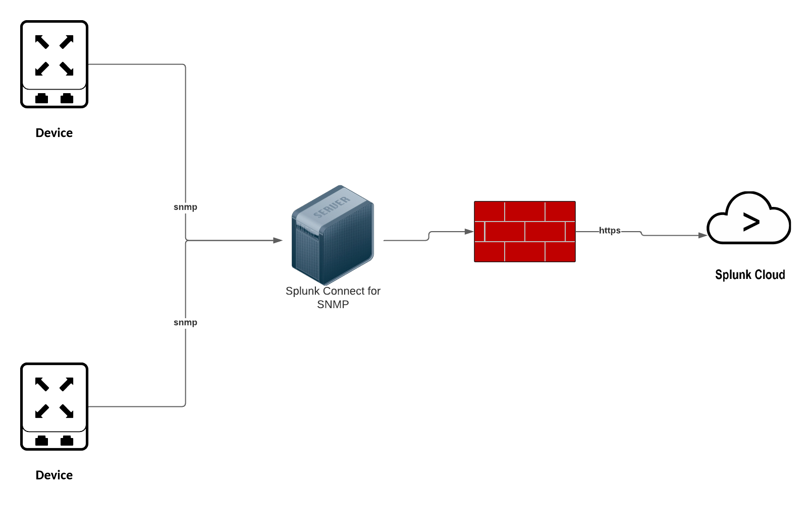

# Planning

Splunk Connect for SNMP (SC4SNMP) is a solution that allows the customer
to \"get\" data from network devices and appliances when a more feature-complete solution, such as the Splunk Universal Forwarder, is not
available.

## Architecture

SC4SNMP is deployed using a Kubernetes distribution, typically MicroK8s,
that's designed to be a low-touch experience for integration with sensitive
edge network devices. It will typically be deployed in the same network
management zone as the monitored devices and separated from Splunk by an
existing firewall.

## Requirements

-   A supported deployment of MicroK8s

-   16 Core/32 threads x64 architecture server or vm (single instance)
    12 GB ram

-   HA Requires 3 or more instances (odd numbers) 8 core/16 thread 16 GB
    ram

-   50 GB root mount

-   HTTP access (non-proxy) allowed for the HTTP(s) connection from
    SC4SNMP to the Splunk destination.

-   Splunk Enterprise/Cloud 8.x or newer and/or Splunk Infrastructure Monitoring
    (SignalFx)
    

## Planning Infrastructure

A single installation of Splunk Connect for SNMP (SC4SNMP) on a machine with
16 Core/32 threads x64 and 64 GB RAM will be able to handle up to 1500
SNMP TRAPs per second.

A single installation of Splunk Connect for SNMP (SC4SNMP) on a machine with
16 Core/32 threads x64 and 64 GB RAM is able to handle up to 2750 SNMP varbinds per second. 
As for events per second visible in Splunk, please remember that a single SC4SNMP event can contain more than one varbind inside - auto aggregation/grouping feature (varbinds which are describing same thing ie. network interface will be grouped in one event). 
That is why, depending on configuration, the number of events per second may vary. 

When planning infrastructure for Splunk Connect for SNMP, (SC4SNMP) note the limitations highlighted above.
