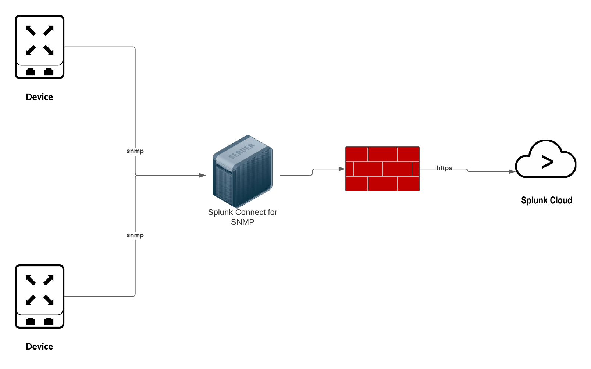

... Planning

Planning
===================================================

Splunk Connect for SNMP (SC4SNMP) is a solution that allows the customer to "get" data from 
network devices and appliances where a more feature complete solution such as the 
Splunk Universal Forwarder is not available.

Architecture
===================================================

SC4SNMP is deployed using a Kubernetes distribution typically MicroK8s, deseigned to be 
a low touch experience for integration with sensitive edge network devices it will typically be
deployed in the same network management zone as the monitored devices and seperated from Splunk by
an existing firewall.

Requirements
===================================================

* A supported deployment of MicroK8s 
* 16 Core/32 threads x64 architecture server or vm (single instance) 12 GB ram
* HA Requires 3 or more instances (odd numbers) 8 core/16 thread 16 GB ram
* 100 GB root mount
* http access (non proxy) allowed for the HTTP(s) connection from SC4SNMP to the Splunk destination.
* Splunk Enterprise/Cloud 8.x and or Splunk Infrastructure Monitoring (SignalFX)
* Splunk Enterprise/Cloud specific Requirements
    * Splunk ITSI or Splunk IT Work
    * Ability to create a HEC token 
    * Ability to create event and metrics indexes (or use existing)
* Splunk Infrastructure Monitoring specific requirements
    * Ability to create of obtain real and token

